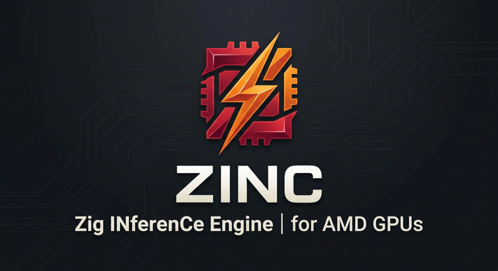
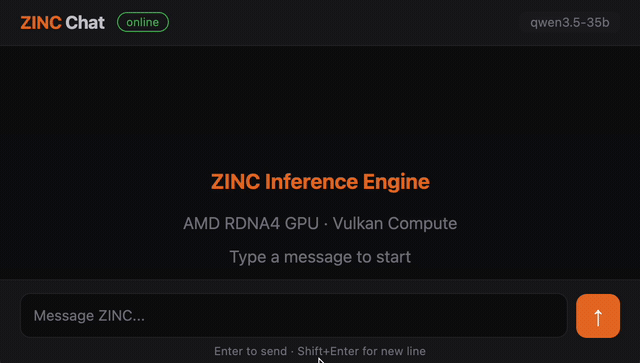
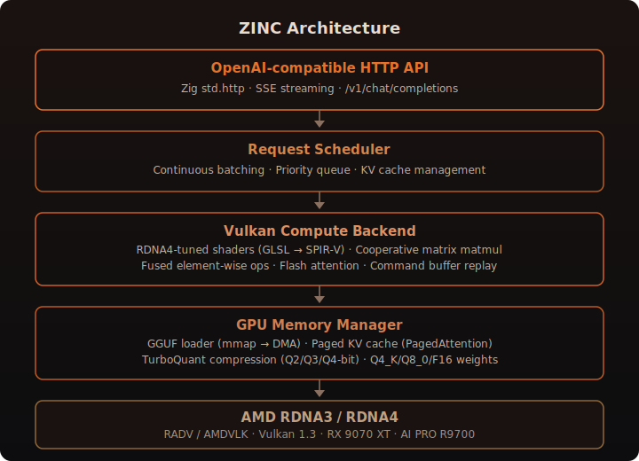

<p align="center">
  
</p>

# ZINC — Zig INferenCe Engine for AMD GPUs

<p align="center">
  <a href="https://github.com/zolotukhin/zinc/actions/workflows/test.yml">
    
  </a>
  <a href="https://ziglang.org/download/">
    
  </a>
  <a href="LICENSE">
    
  </a>
  
  <a href="https://zolotukhin.ai/zinc">
    
  </a>
  <a href="https://discord.gg/tNDEgTG5s">
    
  </a>
</p>

> Making AMD consumer GPUs actually usable for LLM inference.

<p align="center">
  
  <br>
  <em>35B parameter model running locally on a single AMD GPU — Zig + Vulkan, no ROCm, no CUDA</em>
</p>

## Best Supported Setup

- Linux
- AMD RDNA4 GPU with 16-32 GB VRAM
- Mesa RADV with `RADV_PERFTEST=coop_matrix`
- `zig build -Doptimize=ReleaseFast`

macOS can build the project and is fine for development, but it is not the primary target environment for real ZINC GPU inference.

## Start Here

If you want the shortest path to a successful first run:

```bash
git clone https://github.com/zolotukhin/zinc.git
cd zinc
zig build -Doptimize=ReleaseFast

# Recommended on RDNA4 before checks and benchmarks
export RADV_PERFTEST=coop_matrix

# Verify Vulkan, shaders, and runtime setup
./zig-out/bin/zinc --check

# See which supported models fit this machine
./zig-out/bin/zinc model list

# Download one supported model
./zig-out/bin/zinc model pull qwen35-2b-q4k-m

# Run a prompt with the managed model
./zig-out/bin/zinc --model-id qwen35-2b-q4k-m --prompt "Hello"
```

If you want the browser UI instead, start the server with:

```bash
./zig-out/bin/zinc --model-id qwen35-2b-q4k-m -p 8080
```

Then open `http://localhost:8080/`.

## What Works Today

- Single-stream CLI inference on the validated Qwen3.5 models listed below
- OpenAI-compatible `/v1` API
- Built-in browser chat UI at `/`
- Managed model workflow: `list`, `pull`, `use`, `active`, and `rm`
- RDNA4-tuned Vulkan path with coherent outputs on the supported GGUFs

## Still Rough

- Continuous batching and stronger multi-tenant serving are still roadmap work
- Chat/reasoning workloads are still slower than the raw decode path
- The supported-model list is intentionally narrow
- macOS is useful for building and docs work, but not the target runtime for GPU inference

## The Problem

AMD's RDNA3/RDNA4 GPUs (RX 9070, Radeon AI PRO R9700, etc.) have excellent memory bandwidth (576+ GB/s) and hardware features (cooperative matrix, integer dot product), but:

1. **ROCm doesn't support them** — only MI-series datacenter GPUs
2. **vLLM requires ROCm** — so it can't use these GPUs at all
3. **llama.cpp Vulkan works** but treats RDNA4 as an afterthought — no RDNA4-specific tuning, SPIR-V toolchain incompatibilities, no tensor parallelism
4. **No solution handles parallel requests well** on these GPUs for production use

These cards cost $500–1500 (vs $15,000+ for MI300X) and sit in millions of desktops doing nothing during inference.

## The Solution

ZINC takes the hardware these cards already have — 576 GB/s memory bandwidth, cooperative matrix units, 16–32 GB VRAM — and builds an inference engine that actually uses it.

**Hand-tuned for the hardware.** The GPU shaders are written specifically for RDNA4's memory hierarchy: wave64 dispatch, architecture-aware tiling, fused operations that cut redundant VRAM round-trips. Not a generic Vulkan backend that happens to run on AMD — built to hit 90%+ of theoretical memory bandwidth on the matmuls that dominate LLM decode.

**Built for real inference work, not just demos.** The current engine already has a fast CLI path, an OpenAI-compatible API, graph-report tooling, and hardware-aware benchmarking on RDNA4. Continuous batching and deeper TurboQuant validation are still roadmap work, so today's server path should be read as a strong single-stream engine rather than a finished multi-tenant serving stack.

**Drop-in compatible.** The API is OpenAI-compatible — point your existing client at it and it works. No ROCm, no CUDA, no driver stack to fight. One binary, one GPU, production inference on a $550 card.

## Supported Models

The table below is intentionally narrow: it lists the exact GGUFs ZINC currently supports and that we have revalidated end-to-end, not a broader wishlist of architectures that might work.

| Model | Exact GGUF tested | Typical throughput on AI PRO R9700 |
|------|--------------------|-------------------------------------|
| **Qwen3.5 2B** | [Qwen3.5-2B-Q4_K_M.gguf](https://huggingface.co/unsloth/Qwen3.5-2B-GGUF) | ~22 tok/s plain generation, ~17 tok/s reasoning chat |
| **Qwen3.5 35B-A3B UD** | [Qwen3.5-35B-A3B-UD-Q4_K_XL.gguf](https://huggingface.co/unsloth/Qwen3.5-35B-A3B-GGUF) | ~33 tok/s plain generation, ~25–29 tok/s reasoning chat |

Benchmark details for the numbers above:

- Hardware: AMD Radeon AI PRO R9700 (RDNA4, 32 GB)
- Build: `zig build -Doptimize=ReleaseFast`
- Run shape: single-stream, `RADV_PERFTEST=coop_matrix`
- Plain generation: 256-token runs without chat template or explicit reasoning
- Reasoning chat: non-streaming `/v1/chat/completions` with step-by-step prompts
- Latest validation date: 2026-03-30
- Validation: coherent output on CLI, raw `/v1/completions`, and `/v1/chat/completions`

**Quantization formats implemented in the current kernels**: Q4_K, Q5_K, Q6_K, Q8_0, F16

## Quick Start

### Prerequisites

| Tool | Install |
|------|---------|
| Zig 0.15.2+ | [ziglang.org/download](https://ziglang.org/download/) |
| Vulkan loader + tools | `apt install libvulkan-dev vulkan-tools` (Linux) or `brew install vulkan-loader vulkan-headers` (macOS) |
| `glslc` on Linux | `apt install glslc` |
| Bun for tests and the docs site | `curl -fsSL https://bun.sh/install \| bash` |

**Important**: On Linux with RDNA4, newer `glslc` releases can cause a large regression. Use the system package version.

### Build ZINC

```bash
git clone https://github.com/zolotukhin/zinc.git
cd zinc

# Build the CLI and server
# macOS: shaders are skipped
# Linux: shaders are compiled automatically
zig build -Doptimize=ReleaseFast
```

The binary is placed in `zig-out/bin/zinc`. Compiled SPIR-V shaders go to `zig-out/share/zinc/shaders/`.
Use `ReleaseFast` for any performance measurement or server deployment. Plain `zig build` is not a fair throughput baseline.

### Run a Preflight Check First

Before your first prompt, run `--check`. The target state is a clean `READY [OK]` run with no warnings.

```bash
# General machine + Vulkan + shader preflight
./zig-out/bin/zinc --check

# Recommended on RDNA4 before measuring performance
export RADV_PERFTEST=coop_matrix
./zig-out/bin/zinc --check

# Check one exact GGUF file
./zig-out/bin/zinc --check -m /path/to/model.gguf

# Check one managed catalog model by id
./zig-out/bin/zinc --check --model-id qwen35-35b-a3b-q4k-xl
```

`--check` verifies:

- host environment and RDNA4-specific shell hints
- compiled shader assets
- Vulkan device discovery and the selected GPU
- GGUF metadata when you pass `-m /path/to/model.gguf`
- managed-model compatibility when you pass `--model-id <id>`
- estimated single-GPU VRAM fit for the current runtime

If `--check` reports warnings, treat them as setup work to finish before judging runtime behavior. For the full walkthrough, see [Running ZINC](docs/RUNNING_ZINC.md) and [Hardware requirements](docs/HARDWARE_REQUIREMENTS.md).

### Choosing Models

The README keeps the supported-model table narrow on purpose and leaves the full managed-model workflow to the docs.

Use these for model selection, cache management, and API details:

- [Running ZINC](https://zolotukhin.ai/zinc/docs/running-zinc)
- [Serving HTTP API](https://zolotukhin.ai/zinc/docs/api)

### Run a Prompt

```bash
./zig-out/bin/zinc -m /path/to/model.gguf --prompt "The capital of France is"
```

### Run the Server

Start the server — no `--prompt` flag means server mode:

```bash
./zig-out/bin/zinc -m /path/to/model.gguf -p 8080
```

Then open **http://localhost:8080/** in your browser for the built-in chat interface.

### Use the API

ZINC exposes an OpenAI-compatible API at `/v1`.

For the actual request examples and SDK usage, use the website docs instead of the README:

- [Running ZINC](https://zolotukhin.ai/zinc/docs/running-zinc) for CLI, server mode, and first-run examples
- [Serving HTTP API](https://zolotukhin.ai/zinc/docs/api) for `curl`, OpenAI SDK examples, endpoint behavior, and response shapes

The built-in chat UI is served at `/`, the API is under `/v1`, and the health endpoint is `/health`.

## Development

### Development Setup

If you are working on ZINC itself, install Bun too. Zig is required for the engine, and Bun is used for repo tooling, tests, and the docs site.

```bash
git clone https://github.com/zolotukhin/zinc.git
cd zinc

# Build the project
zig build -Doptimize=ReleaseFast

# Run Zig + Bun tests
zig build test --summary all

# Require the integration smoke tests too
# Fails if the smoke env vars below are missing
ZINC_QWEN35_2B_MODEL=/path/to/Qwen3.5-2B-Q4_K_M.gguf \
ZINC_QWEN35_35B_MODEL=/path/to/Qwen3.5-35B-A3B-UD-Q4_K_XL.gguf \
ZINC_API_BASE_URL=http://localhost:8080/v1 \
zig build test --summary all -Dfull-tests=true
```

If you only want the Bun suite:

```bash
bun test
```

If you are changing website docs in `site/`:

```bash
cd site
bun install
bun run dev
```

For contributor workflow and expectations, see [CONTRIBUTING.md](./CONTRIBUTING.md).

### Export Decode Graph Artifacts

```bash
# Machine-readable structural report for custom tooling
./zig-out/bin/zinc -m /path/to/model.gguf --graph-report decode-graph.json

# Graphviz DOT for quick rendering/debugging
./zig-out/bin/zinc -m /path/to/model.gguf --graph-dot decode-graph.dot

# Both at once
./zig-out/bin/zinc -m /path/to/model.gguf \
  --graph-report decode-graph.json \
  --graph-dot decode-graph.dot
```

### Visualize the Decode Graph

The graph export is intended for debugging and performance work before adding a richer runtime profiler. The JSON report is the main analysis artifact, and the DOT file is optional.

- `decode-graph.json`: model-aware analysis report with bytes, FLOPs, hotspots, and bottleneck labels
- `decode-graph.dot`: full dependency graph for Graphviz rendering

Typical workflow:

```bash
# 1. Export the analysis JSON, and DOT if you want the raw structure too
./zig-out/bin/zinc -m /path/to/model.gguf \
  --graph-report decode-graph.json \
  --graph-dot decode-graph.dot

# 2. Render the readable HTML dashboard with Bun
bun run graph:render -- decode-graph.json decode-graph-report.html

# 3. Open the report
open decode-graph-report.html   # macOS
# xdg-open decode-graph-report.html   # Linux
```

If you want the raw dependency graph as an image and have Graphviz installed:

```bash
dot -Tsvg decode-graph.dot -o decode-graph.svg
```

Useful JSON inspection commands:

```bash
# Top-level structural summary
jq '{name, node_count, edge_count, max_depth, max_parallel_width, critical_path_node_count}' decode-graph.json

# Which op types dominate the graph?
jq '.op_counts' decode-graph.json

# Show the structural critical path
jq '.critical_path' decode-graph.json

# Inspect nodes that lie on the critical path
jq '.nodes[] | select(.is_on_critical_path)' decode-graph.json
```

How to read the output:

- `op_counts` shows which logical ZINC operations dominate the decode DAG, such as `dmmv`, `flash_attn`, `rope`, and `swiglu`
- `max_depth` and `critical_path_node_count` describe the longest dependency chain through the graph
- `max_parallel_width` shows the widest layer of structurally independent work
- nodes marked `is_on_critical_path` are the best first candidates when you want to reduce total decode latency
- the current export is structural, not timed: it tells you where parallelism and dependencies exist, not yet how long each node took on GPU

The DOT export highlights critical-path nodes in red so you can see the longest chain immediately. The JSON export is the better source for automated analysis or a future in-browser visualizer.

## Contributing

Outside help is useful, especially for:

- bug reproduction on more hardware and operating systems
- build and packaging fixes
- docs and API polish
- test coverage
- performance diagnostics and benchmark tooling

Start with [CONTRIBUTING.md](./CONTRIBUTING.md). If you are reporting a bug or regression, include the exact hardware, model, driver/runtime, and command you used.

Project expectations and planning live here:

- [Code of Conduct](./CODE_OF_CONDUCT.md)
- [Roadmap](./docs/ROADMAP.md)

## CLI Reference

```
Usage: zinc [options]
  -m, --model <path>       Path to GGUF model file (required)
  -p, --port <port>        Server port (default: 8080)
  -d, --device <id>        Vulkan device index (default: 0)
  -c, --context <size>     Context length (default: 4096)
  --parallel <n>           Max concurrent requests (default: 4)
  --prompt <text>          Single prompt (CLI mode, no server)
  --kv-quant <bits>        TurboQuant KV cache bits: 0/2/3/4 (default: 0=off)
  --graph-report <path>    Write decode-graph JSON report from GGUF metadata
  --graph-dot <path>       Write decode-graph Graphviz DOT from GGUF metadata
  --debug                  Enable verbose debug logging (or set ZINC_DEBUG=1)
  -h, --help               Show this help
```

The JSON report includes node/edge lists, op-type counts, per-node depth, root/leaf flags, and the structural critical path. The DOT export is intended for Graphviz or downstream visualization tools.

### Tests

```bash
# Zig unit tests (18 tests)
zig build test

# TypeScript loop tests (34 tests)
bun test loops/

# All tests
zig build test && bun test loops/
```

## Spec Kit

This repo keeps its Spec Kit workflow in `.specify/`.

- Claude uses the existing command docs in `.claude/commands/speckit.*.md`.
- Codex uses skills in `.agents/skills/speckit-*`, matching Spec Kit `--ai-skills` mode.
- For Codex, prefer the `speckit-*` skills over custom prompt files.
## Self-Improving Optimization Loop

ZINC includes an AI-powered self-improving loop that iteratively builds, deploys, and fixes/optimizes the engine on real RDNA4 hardware.

### Setup

Create a `.env` file with your remote RDNA4 node credentials:

```bash
ZINC_HOST=your.server.ip
ZINC_PORT=22
ZINC_USER=root
```

The remote node needs: Zig 0.15.2+, Vulkan drivers, glslc, and a GGUF model file.

### Run the Loop

```bash
# Dry run — verifies SSH, rsync, build, and run (no AI agent)
bun loops/optimize_zinc.ts --dry-run

# Run 1 cycle
bun loops/optimize_zinc.ts --cycles 1

# Run overnight (infinite cycles, ctrl+c to stop)
bun loops/optimize_zinc.ts

# Custom model path
bun loops/optimize_zinc.ts --model-path /root/models/Qwen3-8B-Q4_K.gguf

# Resume a previous run
bun loops/optimize_zinc.ts --resume .zinc_optimize/2026-03-26T...
```

### How It Works

Each cycle:
1. **rsync** local source to the remote RDNA4 node
2. **Build** via `zig build -Doptimize=ReleaseFast` (compiles Zig + GLSL shaders)
3. **Run** `zinc --prompt ...` and capture output
4. **Analyze** — build errors? runtime crash? tok/s metrics?
5. **Spawn Claude** with full context (errors, history, RDNA4 constraints)
6. Claude edits local source files (one focused change per cycle)
7. **Verify** — rsync + rebuild + rerun
8. **Keep or revert** — git checkpoint, revert if regression

Two phases:
- **FIX** — resolve build errors, shader issues, Vulkan crashes
- **OPTIMIZE** — improve throughput once running (tok/s, bandwidth utilization)

Results are saved to `.zinc_optimize/` with full logs per cycle.

## RDNA4 Hardware Setup

For running ZINC on AMD RDNA4 GPUs:

```bash
# Required: enable cooperative matrix support
export RADV_PERFTEST=coop_matrix

# Recommended: disable GPU ECC for ~10% more bandwidth
# Add to /etc/default/grub:
GRUB_CMDLINE_LINUX_DEFAULT="... amdgpu.ras_enable=0"
# Then: update-grub && reboot
```

## Architecture

<p align="center">
  
</p>

## Benchmarks

All numbers below were measured on **AMD Radeon AI PRO R9700** (RDNA4, 32 GB, 576 GB/s) on a clean RDNA4 node using `RADV_PERFTEST=coop_matrix` and `zig build -Doptimize=ReleaseFast`.

### Current Validated Snapshot (2026-03-30)

| Path | Shape | Result |
|------|-------|--------|
| Qwen3.5-35B-A3B-UD CLI plain decode | `--prompt "The capital of France is"`; 256 generated tokens; no chat template/thinking | **33.58 tok/s**, `29.8 ms/tok` |
| Qwen3.5-35B-A3B-UD raw HTTP plain decode | `POST /v1/completions`, `concurrency=1`, `max_tokens=256`; no chat template/thinking | **33.55 tok/s** |
| Qwen3.5-35B-A3B-UD raw HTTP | `POST /v1/completions`, `concurrency=4`, `max_tokens=256` | **33.98 tok/s aggregate**, `18.84s` avg latency, `29.01s` p95 |
| Qwen3.5-35B-A3B-UD reasoning chat | `POST /v1/chat/completions`, 3 non-streaming step-by-step prompts, 186–257 completion tokens | **24.94–28.56 tok/s** |
| Qwen3.5-2B-Q4_K_M CLI plain decode | `--prompt "The capital of France is"`; 256 generated tokens; no chat template/thinking | **22.93 tok/s**, `43.6 ms/tok` |
| Qwen3.5-2B-Q4_K_M raw HTTP plain decode | `POST /v1/completions`, `concurrency=1`, `max_tokens=256`; no chat template/thinking | **21.88 tok/s** |
| Qwen3.5-2B-Q4_K_M raw HTTP | `POST /v1/completions`, `concurrency=4`, `max_tokens=256` | **21.36 tok/s aggregate**, `29.59s` avg latency, `46.06s` p95 |
| Qwen3.5-2B-Q4_K_M reasoning chat | `POST /v1/chat/completions`, 3 non-streaming step-by-step prompts | **17.35–17.50 tok/s** |

For reference, the current llama.cpp baseline on the same node and model is about **107 tok/s decode**.

### What These Numbers Mean

- The clean ReleaseFast decode path is already above the `30 tok/s` mark on the 35B model.
- The `33.58 tok/s`, `33.55 tok/s`, `22.93 tok/s`, and `21.88 tok/s` figures are plain decode numbers, not thinking-enabled runs.
- The raw OpenAI-compatible `/v1/completions` route now tracks CLI closely on both supported models, so the main remaining overhead is not the basic HTTP wrapper.
- The current proxy for "thinking enabled" throughput is the reasoning-chat row, which uses `/v1/chat/completions` with longer step-by-step prompts rather than a separate model-side thinking toggle.
- The remaining gap is the chat/reasoning route: longer templated chat answers are still slower than raw decode on both models.
- The 2B model is currently slower than the 35B MoE model on this node, which means today's bottleneck is not just "smaller model = faster"; kernel shape, architecture mix, and decode-path efficiency matter more than parameter count alone.

### Why GPU Bandwidth Is Still Not "Full"

At `33.58 tok/s`, the modeled full-token decode bandwidth is about **112.5 GB/s**, or **19.5%** of the card's `576 GB/s` peak.

That is not a contradiction. Single-stream decode is not a pure DRAM-streaming workload. The remaining headroom is dominated by serialized medium/small kernels and graph depth, not by large host-side stalls. If the goal is to drive memory bandwidth materially higher than this, the next lever is **concurrent decode / batching**, not expecting one stream to saturate all DRAM bandwidth on its own.

### Historical Note

The older March 27–29 optimization logs in `.zinc_optimize/` were useful for correctness and early performance work, but many of the old `7–16 tok/s` figures came from debug-heavy or non-`ReleaseFast` builds. The snapshot above is the current clean baseline to compare against.

## Current Status

| Component | Status |
|-----------|--------|
| Vulkan infrastructure | Done |
| GGUF parser + model loader | Done |
| GPU detection (RDNA3/4) | Done |
| Native BPE tokenizer (from GGUF) | Done |
| GLSL compute shaders (16) | Done |
| Compute graph + architecture builders | Done |
| Forward pass (decode loop) | Working — 33.58 tok/s clean CLI on Qwen3.5-35B-A3B-UD |
| GPU SSM shaders + cmd batching | Done — clean ReleaseFast path is above 30 tok/s |
| HTTP server + OpenAI API | Done — 35B raw API ~33.5 tok/s, 2B raw API ~21.9 tok/s, reasoning chat still slower |
| Continuous batching | Phase 4 |
| TurboQuant KV compression | Phase 5 |

Validated on AMD Radeon AI PRO R9700 (RDNA4): Vulkan 1.3 init, GGUF parsing, 21 GB model loaded to VRAM, 723-node MoE graph built, coherent inference output verified against CPU reference.

## Next Steps

The next push is from "raw decode above 30" to "reasoning workloads above 30 and better aggregate GPU utilization":

1. **Close the chat/reasoning gap** — benchmark longer chat prompts, template overhead, stop behavior, and TTFT so `/v1/chat/completions` tracks closer to the raw decode path.
2. **Make profiling representative** — `--profile` is still too intrusive in `ReleaseFast`, so it is not yet the right leaderboard tool for apples-to-apples throughput claims.
3. **Reduce hot-path descriptor churn** — reuse bindings and trim per-token Vulkan setup in the decode loop.
4. **Tune the actual hot shapes** — focus on medium/small decode kernels, not just the vocab projection.
5. **Increase aggregate throughput with batching** — if the goal is to drive bandwidth utilization much higher, concurrency is the right lever.

## License

MIT
