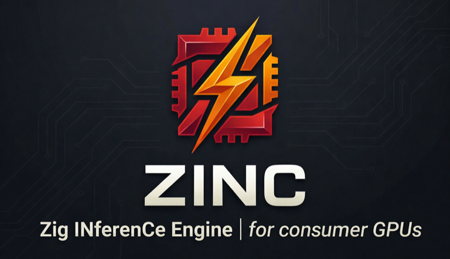

<p align="center">
  
</p>

# ZINC — Zig INferenCe Engine

<p align="center">
  <a href="https://github.com/zolotukhin/zinc/actions/workflows/test.yml">
    
  </a>
  <a href="https://ziglang.org/download/">
    
  </a>
  <a href="LICENSE">
    
  </a>
  
  <a href="https://zolotukhin.ai/zinc">
    
  </a>
  <a href="https://discord.gg/tNDEgTG5s">
    
  </a>
</p>

> Local LLM inference on AMD GPUs and Apple Silicon — no ROCm, no MLX, one binary.

<p align="center">
  
  <br>
  <em>35B parameter model running locally — Zig + Vulkan/Metal, no ROCm, no MLX</em>
</p>

## Supported Platforms

| Platform | GPU | Backend | Status |
|----------|-----|---------|--------|
| **Linux** | AMD RDNA4 (RX 9070, AI PRO R9700) | Vulkan | Primary — hand-tuned shaders |
| **Linux** | AMD RDNA3 (RX 7900 XTX, etc.) | Vulkan | Supported |
| **macOS** | Apple Silicon (M1, M2, M3, M4, M5) | Metal | Supported — native MSL shaders |

## Start Here

Works the same on Linux (AMD GPU) and macOS (Apple Silicon):

```bash
git clone https://github.com/zolotukhin/zinc.git
cd zinc
zig build -Doptimize=ReleaseFast

# On RDNA4 Linux, enable cooperative matrix
export RADV_PERFTEST=coop_matrix  # skip on macOS

# Verify GPU, shaders, and runtime
./zig-out/bin/zinc --check

# See which models fit this machine
./zig-out/bin/zinc model list

# Download a model
./zig-out/bin/zinc model pull llama31-8b-q4k-m

# Run a prompt (--chat applies the model's chat template for instruct models)
./zig-out/bin/zinc --model-id llama31-8b-q4k-m --prompt "Hello" --chat

# Or open the chat UI in your browser
./zig-out/bin/zinc chat
```

The server exposes the built-in chat UI at `/` and an OpenAI-compatible API at `/v1`.

## What Works Today

- Single-stream CLI inference on the validated Qwen3.5 models listed below
- OpenAI-compatible `/v1` API with streaming
- Built-in browser chat UI with thinking mode support
- Managed model workflow: `list`, `pull`, `use`, `active`, `rm`
- `zinc chat` — start server and open browser in one command
- **AMD path**: RDNA4-tuned Vulkan shaders (wave64, cooperative matrix, fused ops)
- **Apple Silicon path**: native Metal shaders (MSL, zero-copy mmap, simdgroup ops)
- Auto-detection: ZINC picks the right backend (Vulkan or Metal) at build time

## Still Rough

- Continuous batching and multi-tenant serving are still roadmap work
- The supported-model list is intentionally narrow
- Apple Silicon performance tuning is ongoing (RDNA4 path is more mature)

## The Problem

Consumer GPUs have the hardware for fast LLM inference — bandwidth, compute, VRAM — but the software doesn't use it:

- **AMD RDNA3/RDNA4**: ROCm doesn't support them. vLLM requires ROCm. llama.cpp's Vulkan path has no RDNA-specific tuning. These $500–1500 cards sit idle.
- **Apple Silicon**: MLX and llama.cpp Metal work, but leave performance on the table. No engine is built from scratch around Metal's strengths (unified memory, simdgroup ops, zero-copy mmap).

## The Solution

ZINC builds an inference engine tuned for the hardware you actually have.

**Hand-tuned shaders for each platform.** On AMD: wave64, cooperative matrix, architecture-aware tiling via Vulkan compute. On Apple Silicon: native MSL kernels with simdgroup reductions, zero-copy model loading, and Metal pipeline tuning. Not a generic backend that happens to run — built to extract real performance from each GPU.

**One binary, no driver stack.** No ROCm, no CUDA, no Python. Build with Zig, point at a GGUF, run inference. The right backend (Vulkan or Metal) is selected automatically at build time.

**Drop-in compatible.** OpenAI-compatible API, built-in chat UI, managed model catalog. Point your existing client at it and it works.

## Supported Models

The table below lists the exact GGUFs ZINC currently supports end-to-end, not a broader wishlist.

| Model | GGUF | AMD RDNA4 | Apple Silicon |
|-------|------|-----------|---------------|
| **Llama 3.1 8B Instruct** | [Q4_K_M](https://huggingface.co/bartowski/Meta-Llama-3.1-8B-Instruct-GGUF) | — | ~10 tok/s |
| **Qwen3 8B** | [Q4_K_M](https://huggingface.co/unsloth/Qwen3-8B-GGUF) | — | ~8 tok/s |
| **Qwen3.5 2B** | [Q4_K_M](https://huggingface.co/unsloth/Qwen3.5-2B-GGUF) | ~27 tok/s | ~17 tok/s (M1 Pro, 32 GB) |
| **Qwen3.5 35B-A3B UD** | [Q4_K_XL](https://huggingface.co/unsloth/Qwen3.5-35B-A3B-GGUF) | ~38 tok/s | **35.6 tok/s** (M4 Max, 64 GB) |

- **AMD**: Radeon AI PRO R9700 (RDNA4, 32 GB), `RADV_PERFTEST=coop_matrix`
- **Apple Silicon**: current 35B reference box is `Mac Studio (Mac16,9)`, `Apple M4 Max`, `40-core GPU`, `64 GB unified memory`; the older 2B bring-up number was on `M1 Pro`, `32 GB`
- All numbers: single-stream `ReleaseFast`; Apple 35B numbers use `bench-metal`, AMD numbers use the CLI decode path
- Latest validation: 2026-04-02
- Use `zinc model list --json` for machine-readable model metadata

**Quantization formats**: Q4_K, Q5_K, Q6_K, Q8_0, F16

## Quick Start

### Prerequisites

| Tool | Install |
|------|---------|
| Zig 0.15.2+ | [ziglang.org/download](https://ziglang.org/download/) |
| Vulkan loader + tools | `apt install libvulkan-dev vulkan-tools` (Linux) or `brew install vulkan-loader vulkan-headers` (macOS) |
| `glslc` on Linux | `apt install glslc` |
| Bun for tests and the docs site | `curl -fsSL https://bun.sh/install \| bash` |

**Important**: On Linux with RDNA4, newer `glslc` releases can cause a large regression. Use the system package version.

### Build ZINC

```bash
git clone https://github.com/zolotukhin/zinc.git
cd zinc

# Build the CLI and server
# macOS: shaders are skipped
# Linux: shaders are compiled automatically
zig build -Doptimize=ReleaseFast
```

The binary is placed in `zig-out/bin/zinc`. Compiled SPIR-V shaders go to `zig-out/share/zinc/shaders/`.
Use `ReleaseFast` for any performance measurement or server deployment. Plain `zig build` is not a fair throughput baseline.

### Run a Preflight Check First

Before your first prompt, run `--check`. The target state is a clean `READY [OK]` run with no warnings.

```bash
# General machine + Vulkan + shader preflight
./zig-out/bin/zinc --check

# Recommended on RDNA4 before measuring performance
export RADV_PERFTEST=coop_matrix
./zig-out/bin/zinc --check

# Check one exact GGUF file
./zig-out/bin/zinc --check -m /path/to/model.gguf

# Check one managed catalog model by id
./zig-out/bin/zinc --check --model-id qwen35-35b-a3b-q4k-xl
```

`--check` verifies:

- host environment and RDNA4-specific shell hints
- compiled shader assets
- Vulkan device discovery and the selected GPU
- GGUF metadata when you pass `-m /path/to/model.gguf`
- managed-model compatibility when you pass `--model-id <id>`
- estimated single-GPU VRAM fit for the current runtime

If `--check` reports warnings, treat them as setup work to finish before judging runtime behavior. For the full walkthrough, see [Running ZINC](docs/RUNNING_ZINC.md) and [Hardware requirements](docs/HARDWARE_REQUIREMENTS.md).

### Choosing Models

The README keeps the supported-model table narrow on purpose and leaves the full managed-model workflow to the docs.

Use these for model selection, cache management, and API details:

- [Running ZINC](https://zolotukhin.ai/zinc/docs/running-zinc)
- [Serving HTTP API](https://zolotukhin.ai/zinc/docs/api)

### Run a Prompt

```bash
./zig-out/bin/zinc -m /path/to/model.gguf --prompt "The capital of France is"
```

### Run the Server

Start the server — no `--prompt` flag means server mode:

```bash
./zig-out/bin/zinc -m /path/to/model.gguf -p 8080
```

Then open **http://localhost:8080/** in your browser for the built-in chat interface.

### Use the API

ZINC exposes an OpenAI-compatible API at `/v1`.

For the actual request examples and SDK usage, use the website docs instead of the README:

- [Running ZINC](https://zolotukhin.ai/zinc/docs/running-zinc) for CLI, server mode, and first-run examples
- [Serving HTTP API](https://zolotukhin.ai/zinc/docs/api) for `curl`, OpenAI SDK examples, endpoint behavior, and response shapes

The built-in chat UI is served at `/`, the API is under `/v1`, and the health endpoint is `/health`.

## Development

For building, testing, debugging, benchmarking, graph export, and contributing — see the **[Development Guide](./docs/DEVELOPMENT.md)** ([web version](https://zolotukhin.ai/zinc/docs/development)).

Quick start:

```bash
zig build -Doptimize=ReleaseFast   # build
zig build test                      # run all tests
./zig-out/bin/zinc --check          # verify GPU/runtime setup
```

See also: [CONTRIBUTING.md](./CONTRIBUTING.md) · [Code of Conduct](./CODE_OF_CONDUCT.md)

## Architecture

<p align="center">
  
</p>

## Benchmarks

All numbers below were measured with `zig build -Doptimize=ReleaseFast`. AMD and Apple Silicon are listed separately because the validated hardware and benchmark harnesses differ.

### Apple Silicon Snapshot (2026-04-02)

Measured on **Mac Studio (Mac16,9)** with **Apple M4 Max**, **40-core GPU**, and **64 GB unified memory**.

| Model | Path | Shape | Result |
|------|------|-------|--------|
| Qwen3.5-35B-A3B-UD-Q4_K_XL | `bench-metal` plain decode | 256 generated tokens, 1 warmup, 3 runs | **35.61 tok/s avg**, `35.58 tok/s` median, `28.1 ms/tok` |
| Qwen3.5-35B-A3B-UD-Q4_K_XL | `bench-metal` prefill | same run set | **36.2 tok/s avg**, `36.6 tok/s` median |
| Qwen3.5-35B-A3B-UD-Q4_K_XL | raw HTTP `/v1/completions` | `max_tokens=256`, `concurrency=1` | **34.74 tok/s**, `7.37s` avg latency |
| Qwen3.5-35B-A3B-UD-Q4_K_XL | raw HTTP `/v1/completions` | `max_tokens=256`, `concurrency=4` | **34.71 tok/s** aggregate, `18.45s` avg latency, `28.40s` p95 |

### AMD RDNA4 Snapshot (2026-03-31)

Measured on **AMD Radeon AI PRO R9700** (RDNA4, 32 GB, 576 GB/s) on a clean RDNA4 node using `RADV_PERFTEST=coop_matrix`.

| Model | Path | Shape | Result |
|------|------|-------|--------|
| Qwen3.5-35B-A3B-UD-Q4_K_XL | CLI plain decode | `--prompt "The capital of France is"`; 128 generated tokens | **37.95 tok/s**, `26.3 ms/tok` |
| Qwen3.5-2B-Q4_K_M | CLI plain decode | `--prompt "The capital of France is"`; 128 generated tokens | **26.71 tok/s**, `37.4 ms/tok` |

For reference, the current llama.cpp baseline on the same node and 35B model is about **107 tok/s decode**.

### What These Numbers Mean

- The Apple Silicon 35B path is no longer speculative. On the current M4 Max validation box it sustains **35.6 tok/s** locally and keeps the raw HTTP path close behind at about **34.7 tok/s**.
- The RDNA4 path is still faster on the same 35B model, but the gap is now small enough that the two backends are in the same performance class for single-stream decode.
- The 2B model is currently slower than the 35B MoE model on the RDNA4 node, which means today's bottleneck is not just "smaller model = faster"; kernel shape, architecture mix, and decode-path efficiency matter more than parameter count alone.

### Why GPU Bandwidth Is Still Not "Full"

On the RDNA4 node, at `37.95 tok/s`, the modeled full-token decode bandwidth is about **127.1 GB/s**, or **22.1%** of the card's `576 GB/s` peak.

That is not a contradiction. Single-stream decode is not a pure DRAM-streaming workload. The remaining headroom is dominated by serialized medium/small kernels and graph depth, not by large host-side stalls. If the goal is to drive memory bandwidth materially higher than this, the next lever is **concurrent decode / batching**, not expecting one stream to saturate all DRAM bandwidth on its own.

### Historical Note

The older March 27–29 optimization logs in `.zinc_optimize/` were useful for correctness and early performance work, but many of the old `7–16 tok/s` figures came from debug-heavy or non-`ReleaseFast` builds. The snapshot above is the current clean baseline to compare against.

## Current Status

| Component | Status |
|-----------|--------|
| Vulkan infrastructure | Done |
| GGUF parser + model loader | Done |
| GPU detection (RDNA3/4) | Done |
| Native BPE tokenizer (from GGUF) | Done |
| GLSL compute shaders (16) | Done |
| Compute graph + architecture builders | Done |
| Forward pass (decode loop) | Working — 37.95 tok/s on RDNA4 and 35.61 tok/s on Apple M4 Max for Qwen3.5-35B-A3B-UD |
| GPU SSM shaders + cmd batching | Done — Metal and Vulkan decode paths are both above 35 tok/s on the validated 35B boxes |
| HTTP server + OpenAI API | Done — 35B raw API ~33.5 tok/s on RDNA4 and ~34.7 tok/s on Apple M4 Max; reasoning chat still slower |
| Continuous batching | Phase 4 |
| TurboQuant KV compression | Phase 5 |

Validated on AMD Radeon AI PRO R9700 (RDNA4): Vulkan 1.3 init, GGUF parsing, 21 GB model loaded to VRAM, 723-node MoE graph built, coherent inference output verified against CPU reference.

## Next Steps

The next push is from "raw decode above 30" to "reasoning workloads above 30 and better aggregate GPU utilization":

1. **Close the chat/reasoning gap** — benchmark longer chat prompts, template overhead, stop behavior, and TTFT so `/v1/chat/completions` tracks closer to the raw decode path.
2. **Make profiling representative** — `--profile` is still too intrusive in `ReleaseFast`, so it is not yet the right leaderboard tool for apples-to-apples throughput claims.
3. **Reduce hot-path descriptor churn** — reuse bindings and trim per-token Vulkan setup in the decode loop.
4. **Tune the actual hot shapes** — focus on medium/small decode kernels, not just the vocab projection.
5. **Increase aggregate throughput with batching** — if the goal is to drive bandwidth utilization much higher, concurrency is the right lever.

## License

MIT
