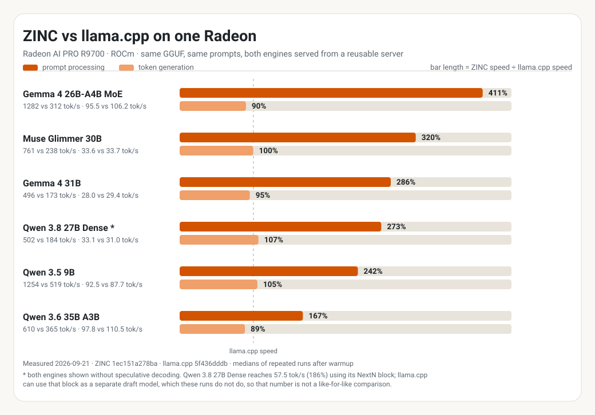

<p align="center">
  
</p>

# ZINC

Fast, local GGUF inference for the GPUs people already own. ZINC is one Zig
binary with a command line, browser chat, model manager, and OpenAI-compatible
API.

<p>
  <a href="https://github.com/zolotukhin/zinc/actions/workflows/test.yml"></a>
  <a href="https://ziglang.org/download/"></a>
  <a href="https://zolotukhin.ai/zinc"></a>
  <a href="https://discord.gg/QRUgWH2aGV"></a>
  <a href="LICENSE"></a>
</p>

[Get started](https://zolotukhin.ai/zinc/docs/getting-started/) ·
[See every benchmark](https://zolotukhin.ai/zinc/benchmarks/#rdna-rocm) ·
[Read the docs](https://zolotukhin.ai/zinc/docs/) ·
[Join Discord](https://discord.gg/QRUgWH2aGV)

## Faster on the hardware we test

ZINC beats the comparison llama.cpp build on **prefill, decode, and combined
time for all six models** in the current Radeon AI PRO R9700 ROCm core suite.
Both engines use the same GPU, GGUF files, prompts, reusable servers, warmups,
and measured run counts.

<a href="https://zolotukhin.ai/zinc/benchmarks/#rdna-rocm">
  
</a>

That is a scoped, reproducible result—not a claim about every model or GPU.
The [live benchmark page](https://zolotukhin.ai/zinc/benchmarks/#rdna-rocm)
includes all four workloads, raw samples, exact prompts, build revisions, and
the checked-in JSON.

## Get running

ZINC needs Zig 0.15.2 or newer. Linux Vulkan builds also need `glslc` and a
Vulkan loader; ROCm builds need a working ROCm installation.

```bash
git clone https://github.com/zolotukhin/zinc.git
cd zinc
zig build -Doptimize=ReleaseFast

./zig-out/bin/zinc --check
./zig-out/bin/zinc model pull qwen35-9b-q4k-m
./zig-out/bin/zinc --model-id qwen35-9b-q4k-m --prompt "Hello" --chat
```

Build the native AMD ROCm backend with:

```bash
ROCM_PATH=/opt/rocm zig build -Dbackend=rocm -Doptimize=ReleaseFast
ROCR_VISIBLE_DEVICES=0 ./zig-out/bin/zinc --check
```

See [Getting started](https://zolotukhin.ai/zinc/docs/getting-started/) for
package prerequisites and the first-run walkthrough, or use the dedicated
[ROCm setup guide](https://zolotukhin.ai/zinc/docs/rocm/).

## Supported GPU paths

- AMD Radeon: Vulkan and ROCm/HIP
- Intel Arc: Vulkan
- Apple Silicon: Metal
- NVIDIA RTX: experimental CUDA

Backends have native kernels and are measured separately. The
[hardware guide](https://zolotukhin.ai/zinc/docs/hardware-requirements/) keeps
the validated cards, drivers, memory requirements, and current limitations in
one place.

## Models

ZINC works with local GGUF files and a managed model catalog. Current tuning
work covers Qwen 3.5, Qwen 3.6, Qwen 3.8, Gemma 4, and Muse Glimmer.

- The Muse checkpoint used in ZINC measurements is the exact
  [Muse-Glimmer-30B-KQuant-17GB-Q4_K_M.gguf](https://huggingface.co/meta-models/Muse-Glimmer-30B-GGUF/blob/main/Muse-Glimmer-30B-KQuant-17GB-Q4_K_M.gguf)
  file published by Meta.
- [Muse Spark 1.3](https://research.meta.ai/blog/introducing-muse-spark-1-3)
  is part of the wider Muse work. It is currently hosted; Meta says the open
  weights are forthcoming. Muse Glimmer is its local distilled counterpart.

You can also point directly at a file or Hugging Face repository:

```bash
./zig-out/bin/zinc -m /path/to/model.gguf --prompt "The capital of France is"
./zig-out/bin/zinc -hf Qwen/Qwen3-0.6B-GGUF:Q8_0 --prompt "Hello" --chat
```

## Local server and API

```bash
./zig-out/bin/zinc chat --model-id qwen35-9b-q4k-m
```

This starts the browser chat and OpenAI-compatible API. Health checks are at
`/health`; model listing and chat completions are under `/v1`. The
[API guide](https://zolotukhin.ai/zinc/docs/api/) has curl and SDK examples.

## Build, test, contribute

```bash
zig build -Doptimize=ReleaseFast
zig build test
```

Benchmark claims come from `tools/performance_suite.mjs`; published artifacts
live in `site/src/data/zinc-performance.json`. Start with the
[development guide](docs/DEVELOPMENT.md) and [contributing guide](CONTRIBUTING.md).

ZINC is active engineering work. If a model or GPU path is incomplete, the
benchmark page leaves that result visible instead of quietly dropping it.

MIT licensed.
