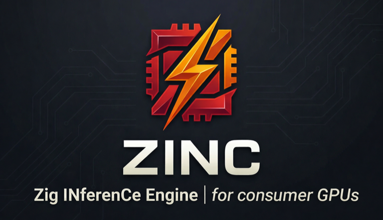
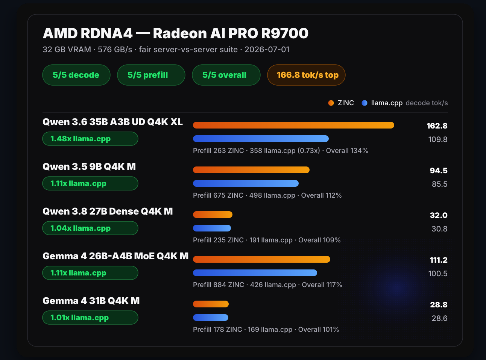
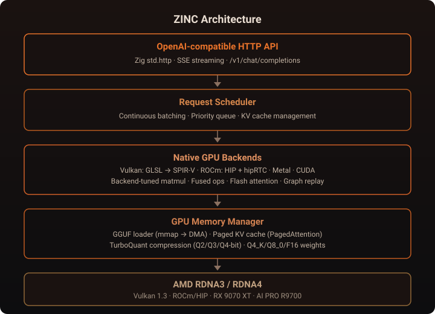

<p align="center">
  
</p>

# ZINC — Zig INferenCe Engine

<p align="center">
  <a href="https://github.com/zolotukhin/zinc/actions/workflows/test.yml">
    
  </a>
  <a href="https://ziglang.org/download/">
    
  </a>
  <a href="LICENSE">
    
  </a>
  
  <a href="https://zolotukhin.ai/zinc">
    
  </a>
  <a href="https://discord.gg/QRUgWH2aGV">
    
  </a>
</p>

> Run GGUF models locally from a single Zig binary. On AMD, choose Vulkan or ROCm; both backends are benchmarked separately against llama.cpp.

<p align="center">
  
</p>

## Measured on AMD RDNA4

These are median Vulkan server results from a Radeon AI PRO R9700. Each row uses
the same GPU, GGUF file, prompt, warmup count, and reusable-server harness for
ZINC and llama.cpp.

| Model | Decode | Prefill | Overall |
|-------|-------:|--------:|--------:|
| Qwen 3.6 35B A3B UD Q4_K_XL | **165.9** vs 109.8 tok/s (**1.51x**) | **415** vs 354 tok/s (**1.17x**) | **146%** |
| Qwen 3.5 9B Q4_K_M | **94.4** vs 85.3 tok/s (**1.11x**) | **675** vs 499 tok/s (**1.35x**) | **112%** |
| Qwen 3.8 27B Dense Q4_K_M | **31.8** vs 30.8 tok/s (**1.03x**) | **236** vs 190 tok/s (**1.24x**) | **108%** |
| Gemma 4 26B-A4B MoE Q4_K_M | **111.2** vs 100.5 tok/s (**1.11x**) | **884** vs 426 tok/s (**2.08x**) | **117%** |
| Gemma 4 31B Q4_K_M | **28.8** vs 28.6 tok/s (**1.01x**) | **178** vs 169 tok/s (**1.05x**) | **101%** |

The closest row is Gemma 4 31B decode at `1.01x`. See the
[benchmark dashboard](https://zolotukhin.ai/zinc/benchmarks) for all scenarios,
ROCm results, run dates, and build details.

### Qwen 3.8 27B on ROCm

Qwen 3.8 now runs ahead of the latest upstream llama.cpp build used for the
comparison in every workload in our R9700 suite. The short-prompt row reaches
32.27 tok/s decode while more than doubling llama.cpp prefill throughput.

| Workload | Prefill, ZINC vs llama.cpp | Decode, ZINC vs llama.cpp | Overall |
|----------|----------------------------:|---------------------------:|--------:|
| Quick chat | **391.8** vs 150.5 tok/s | **32.27** vs 29.83 tok/s | **122.5%** |
| Coding review | **612.7** vs 253.1 tok/s | **31.97** vs 29.83 tok/s | **116.6%** |
| Incident context | **680.4** vs 308.6 tok/s | **31.88** vs 29.83 tok/s | **122.0%** |
| Long coding draft | **426.0** vs 186.7 tok/s | **31.97** vs 29.84 tok/s | **112.1%** |

These are medians of five measured server runs after one discarded warmup,
using the same Q4_K_M GGUF on both engines. The run used llama.cpp commit
`9400c8946`, the tip of upstream `master` when the suite started. Muse Glimmer
30B also remains ahead in all four workloads. Complete samples and provenance
are in [`benchmarks/rocm-r9700.json`](benchmarks/rocm-r9700.json).

## Supported Platforms

| Platform | GPU | Backend | Status |
|----------|-----|---------|--------|
| **Linux** | AMD RDNA4 (RX 9070, AI PRO R9700) | Vulkan | Supported and tuned |
| **Linux** | AMD RDNA4 (validated on AI PRO R9700) | ROCm/HIP | Supported — six-model server matrix complete on `gfx1201` |
| **Linux** | AMD RDNA3 (RX 7900 XTX, etc.) | Vulkan | Supported |
| **Linux** | Intel Arc Xe2 / Battlemage | Vulkan | Supported — validated benchmark target |
| **macOS** | Apple Silicon (M1, M2, M3, M4, M5) | Metal | Supported — native MSL shaders |

ZINC currently focuses on Qwen 3.5/3.6/3.8 and Gemma 4. The supported catalog is
kept deliberately small so each listed model can be tested on real hardware.

## Status vs llama.cpp

This table summarizes the latest checked-in server benchmarks. Each comparison
uses the same machine, model file, prompt, and run count for ZINC and llama.cpp.

| Platform | Compared models | Decode vs llama.cpp | Prefill vs llama.cpp | Read this as |
|----------|----------------:|--------------------:|---------------------:|--------------|
| AMD RDNA4 / Vulkan | 5 | 115% avg, 5/5 model wins | 138% avg, 5/5 model wins | Ahead on every published row |
| AMD RDNA4 / ROCm | 6 | 6/6 model wins | 6/6 model wins | Every core row is ahead; Qwen 3.8 wins all four workloads |
| Intel Arc / Vulkan | 4 | 103% avg, 4/4 model wins | 181% avg, 4/4 model wins | Supported; tuning is newer than RDNA4 |
| Apple Silicon / Metal | 5 | 87% avg, 1 model win | 54% avg, 1 model win | Performance varies by model |

Full per-model numbers are in [Benchmarks](#benchmarks) and on the public
dashboard: [zolotukhin.ai/zinc/benchmarks](https://zolotukhin.ai/zinc/benchmarks).

## Start Here

### Install a prebuilt binary

Prebuilt binaries are installed from GitHub Releases. Until the first release is
published, build from source below. After a release exists, one command works on
Linux x86_64 (Vulkan) or Apple Silicon macOS (Metal):

```bash
curl -fsSL https://raw.githubusercontent.com/zolotukhin/zinc/main/scripts/install.sh | bash
```

The installer downloads the latest published release for your platform, verifies
its SHA-256 checksum, installs under `~/.local/share/zinc`, and links the binary
into `~/.local/bin/zinc`. Pin a version with `ZINC_VERSION=vX.Y.Z`. Prefer
manual? Grab a tarball and `SHA256SUMS.txt` from the
[releases page](https://github.com/zolotukhin/zinc/releases), or read
[`scripts/install.sh`](scripts/install.sh) before piping it into `bash`.

### Or build from source

The default build uses Vulkan on Linux and Metal on macOS:

```bash
git clone https://github.com/zolotukhin/zinc.git
cd zinc
zig build -Doptimize=ReleaseFast

# On RDNA4 Linux, enable cooperative matrix.
# Skip this on Intel Arc and macOS.
export RADV_PERFTEST=coop_matrix

# Verify GPU, shaders, and runtime
./zig-out/bin/zinc --check

# See which models fit this machine
./zig-out/bin/zinc model list

# Download a model
./zig-out/bin/zinc model pull qwen35-9b-q4k-m

# Run a prompt (--chat applies the model's chat template for instruct models)
./zig-out/bin/zinc --model-id qwen35-9b-q4k-m --prompt "Hello" --chat

# Or download any GGUF repo straight from Hugging Face (llama.cpp-style -hf)
./zig-out/bin/zinc -hf Qwen/Qwen3-0.6B-GGUF:Q8_0 --prompt "Hello" --chat

# Or open the chat UI in your browser
./zig-out/bin/zinc chat
```

The server exposes the built-in chat UI at `/` and an OpenAI-compatible API at `/v1`.

## What Works Today

ZINC is usable today as a local, single-user inference engine for the
validated models listed below.

| Area | What you can do today |
|------|------------------------|
| Run models | Use the CLI for single-stream inference on supported GGUF models |
| Chat | Start the built-in browser UI with `zinc chat`, including streaming and thinking-mode display |
| API | Serve OpenAI-compatible `/v1` endpoints with streaming responses |
| Models | Manage catalog models with `list`, `pull`, `use`, `active`, and `rm` |
| AMD GPUs | Choose Vulkan or ROCm/HIP for the installed driver stack |
| Intel Arc | Run the Linux Vulkan backend on Arc Xe2/Battlemage GPUs with the same managed catalog and benchmark harness |
| Apple Silicon | Run the native Metal backend with MSL shaders, zero-copy mmap, and simdgroup ops |
| Setup | Use the default Vulkan or Metal build, or select ROCm explicitly with `-Dbackend=rocm` |

## Current Limitations

- Continuous batching and multi-tenant serving are still roadmap work
- The supported-model list is intentionally narrow
- ROCm Gemma 26B MoE serving currently uses one request slot; multi-request batching for that model is still being developed
- Apple Silicon and Intel Arc performance tuning are ongoing (RDNA4 path is more mature)

## Why ZINC

ZINC is for running local models without a Python service stack. It loads GGUF
files directly, includes a chat UI and an OpenAI-compatible API, and keeps model
management in the same binary.

The GPU code is maintained per backend. AMD has Vulkan and ROCm/HIP paths,
Intel Arc uses Vulkan, and Apple Silicon uses Metal. This lets each backend use
the kernel shapes and memory behavior that work well on that hardware.

## Supported Models

The list below is the model set currently validated on real hardware, not a broader wishlist.

- [Qwen 3.5 9B Q4_K_M](https://huggingface.co/unsloth/Qwen3.5-9B-GGUF) — supported on AMD RDNA4 16/32 GB, Intel Arc, and Apple Silicon
- [Qwen3.6 35B-A3B UD Q4_K_XL](https://huggingface.co/unsloth/Qwen3.6-35B-A3B-GGUF) — supported on AMD RDNA4 32 GB, Intel Arc 32 GB, and Apple Silicon
- [Qwen3.8 27B Dense Q4_K_M](https://huggingface.co/unsloth/Qwen3.8-27B-GGUF) — supported on AMD RDNA4 32 GB and Apple Silicon with 32+ GB unified memory
- Muse Glimmer 30B Q4_K_M — validated on the AMD ROCm backend with a 32 GB Radeon AI PRO R9700
- [Gemma 4 31B Q4_K_M](https://huggingface.co/unsloth/gemma-4-31B-it-GGUF) — supported on AMD RDNA4 32 GB, Intel Arc 32 GB, and Apple Silicon
- [Gemma 4 26B-A4B MoE Q4_K_M](https://huggingface.co/unsloth/gemma-4-26B-A4B-it-GGUF) — supported on AMD RDNA4 32 GB, Intel Arc 32 GB, and Apple Silicon

- Use `zinc model list --json` for machine-readable model metadata
- Current throughput and latency numbers live on the public benchmarks page: [zolotukhin.ai/zinc/benchmarks](https://zolotukhin.ai/zinc/benchmarks)

**Quantization formats**: Q4_K, Q5_K, Q6_K, Q8_0, Q5_0, MXFP4, F16, F32

## Quick Start

### Prerequisites

| Tool | Install |
|------|---------|
| Zig 0.15.2+ | [ziglang.org/download](https://ziglang.org/download/) |
| Vulkan loader + tools | `apt install libvulkan-dev vulkan-tools` (Linux) or `brew install vulkan-loader vulkan-headers` (macOS) |
| `glslc` on Linux | `apt install glslc` |
| Bun for tests and the docs site | `curl -fsSL https://bun.sh/install \| bash` |

**Important**: On Linux with RDNA4, newer `glslc` releases can cause a large regression. Use the system package version.

### Build ZINC

```bash
git clone https://github.com/zolotukhin/zinc.git
cd zinc

# Build the CLI and server
# macOS: shaders are skipped
# Linux: shaders are compiled automatically
zig build -Doptimize=ReleaseFast
```

For the Linux ROCm build:

```bash
ROCM_PATH=/opt/rocm zig build -Dbackend=rocm -Doptimize=ReleaseFast
ROCR_VISIBLE_DEVICES=0 ./zig-out/bin/zinc --check
```

See [ROCm backend](docs/ROCM.md) for prerequisites, runtime switches, and the
reusable-server benchmark procedure.

The binary is placed in `zig-out/bin/zinc`. Compiled SPIR-V shaders go to `zig-out/share/zinc/shaders/`.
Use `ReleaseFast` for any performance measurement or server deployment. Plain `zig build` is not a fair throughput baseline.

### Run a Preflight Check First

Before your first prompt, run `--check`. The target state is a clean `READY [OK]` run with no warnings.

```bash
# General machine + Vulkan + shader preflight
./zig-out/bin/zinc --check

# Recommended on RDNA4 before measuring performance
export RADV_PERFTEST=coop_matrix
./zig-out/bin/zinc --check

# Check one exact GGUF file
./zig-out/bin/zinc --check -m /path/to/model.gguf

# Check one managed catalog model by id
./zig-out/bin/zinc --check --model-id qwen36-35b-a3b-q4k-xl
```

`--check` verifies:

- host environment and RDNA4-specific shell hints
- compiled shader assets
- Vulkan device discovery and the selected GPU
- GGUF metadata when you pass `-m /path/to/model.gguf`
- managed-model compatibility when you pass `--model-id <id>`
- estimated single-GPU VRAM fit for the current runtime

If `--check` reports warnings, treat them as setup work to finish before judging runtime behavior. For the full walkthrough, see [Running ZINC](docs/RUNNING_ZINC.md) and [Hardware requirements](docs/HARDWARE_REQUIREMENTS.md).

### Choosing Models

The full model-management workflow is in the docs.

Use these for model selection, cache management, and API details:

- [Running ZINC](https://zolotukhin.ai/zinc/docs/running-zinc)
- [Serving HTTP API](https://zolotukhin.ai/zinc/docs/api)

### Run a Prompt

```bash
./zig-out/bin/zinc -m /path/to/model.gguf --prompt "The capital of France is"
```

Or skip the manual download and pass a Hugging Face repo (with an optional
`:quant` tag) — ZINC downloads the GGUF into its model cache on first use and
reuses it afterwards:

```bash
./zig-out/bin/zinc -hf Qwen/Qwen3-0.6B-GGUF:Q8_0 --prompt "The capital of France is"
```

### Run the Server

Start the server — no `--prompt` flag means server mode:

```bash
./zig-out/bin/zinc -m /path/to/model.gguf -p 8080
```

Then open **http://localhost:8080/** in your browser for the built-in chat interface.

### Use the API

ZINC exposes an OpenAI-compatible API at `/v1`.

For the actual request examples and SDK usage, use the website docs instead of the README:

- [Running ZINC](https://zolotukhin.ai/zinc/docs/running-zinc) for CLI, server mode, and first-run examples
- [Serving HTTP API](https://zolotukhin.ai/zinc/docs/api) for `curl`, OpenAI SDK examples, endpoint behavior, and response shapes

The built-in chat UI is served at `/`, the API is under `/v1`, and the health endpoint is `/health`.

## Development

For building, testing, debugging, benchmarking, graph export, and contributing — see the **[Development Guide](./docs/DEVELOPMENT.md)** ([web version](https://zolotukhin.ai/zinc/docs/development)).

Quick start:

```bash
zig build -Doptimize=ReleaseFast   # build
zig build test                      # run all tests
./zig-out/bin/zinc --check          # verify GPU/runtime setup
```

See also: [CONTRIBUTING.md](./CONTRIBUTING.md) · [Code of Conduct](./CODE_OF_CONDUCT.md)

## Architecture

<p align="center">
  
</p>

## Benchmarks

The tables below come from the data used by [the benchmark dashboard](https://zolotukhin.ai/zinc/benchmarks). Values are median tok/s from repeated runs. ZINC and llama.cpp use the same hardware, model file, prompt, and reusable-server setup.

### AMD RDNA4 — Radeon AI PRO R9700 (Vulkan)

| Model | ZINC prefill | llama.cpp prefill | ZINC % | ZINC decode | llama.cpp decode | ZINC % |
|---|---:|---:|---:|---:|---:|---:|
| Qwen 3.6 35B A3B UD Q4_K_XL | **414.76** | 353.75 | **117%** | **165.90** | 109.78 | **151%** |
| Qwen 3.5 9B Q4_K_M | **675.17** | 497.65 | **136%** | **94.49** | 85.46 | **111%** |
| Qwen 3.8 27B Dense Q4_K_M | **235.06** | 190.67 | **123%** | **31.98** | 30.80 | **104%** |
| Gemma 4 26B-A4B MoE Q4_K_M | **883.66** | 425.85 | **208%** | **111.22** | 100.45 | **111%** |
| Gemma 4 31B Q4_K_M | **177.89** | 169.48 | **105%** | **28.83** | 28.60 | **101%** |

### AMD RDNA4 — Radeon AI PRO R9700 (ROCm/HIP)

The ROCm suite covers six models and four scenarios per model. Every model
completes the reusable-server matrix with coherent output. In the core workload,
ZINC is ahead on prefill, decode, and the combined score for all six models.
Gemma 26B currently uses its single-sequence MoE path for serving.

| Model | ZINC prefill | llama.cpp prefill | ZINC decode | llama.cpp decode | Overall |
|---|---:|---:|---:|---:|---:|
| Qwen 3.6 35B A3B Q4_K_XL | **581.18** | 506.12 | **80.89** | 66.34 | **121.4%** |
| Gemma 4 26B-A4B MoE Q4_K_M | **1166.49** | 623.75 | **80.28** | 70.08 | **117.3%** |
| Qwen 3.5 9B Q4_K_M | **1135.87** | 779.92 | **78.76** | 69.99 | **113.3%** |
| Qwen 3.8 27B Q4_K_M | **391.76** | 150.51 | **32.27** | 29.83 | **122.5%** |
| Muse Glimmer 30B Q4_K_M | **629.33** | 386.32 | **30.15** | 27.90 | **110.4%** |
| Gemma 4 31B Q4_K_M | **423.03** | 189.39 | **24.95** | 23.06 | **111.8%** |

Qwen 3.8 also completed every scenario ahead of the latest upstream llama.cpp
server used for this run, on both prefill and decode:

| Scenario | ZINC prefill | llama.cpp prefill | ZINC decode | llama.cpp decode | Overall |
|---|---:|---:|---:|---:|---:|
| Quick Chat | **391.76** | 150.51 | **32.27** | 29.83 | **122.5%** |
| Coding Review | **612.68** | 253.09 | **31.97** | 29.83 | **116.6%** |
| Incident Context | **680.43** | 308.56 | **31.88** | 29.83 | **122.0%** |
| Long Coding Draft | **426.03** | 186.73 | **31.97** | 29.84 | **112.1%** |

See the [ROCm backend guide](docs/ROCM.md) for the validated software stack and
the exact benchmark command.

### Apple Silicon M4 Max (Metal)

| Model | ZINC prefill | llama.cpp prefill | ZINC % | ZINC decode | llama.cpp decode | ZINC % |
|---|---:|---:|---:|---:|---:|---:|
| Gemma 4 26B-A4B MoE Q4_K_M | 327.87 | 407.46 | 81% | 69.51 | 82.81 | 83% |
| Gemma 4 31B Q4_K_M | **131.07** | 102.28 | **128%** | 22.68 | 22.70 | 100% |
| Qwen 3.5 9B Q4_K_M | 36.53 | 332.65 | 11% | 29.42 | 57.87 | 52% |
| Qwen 3.6 35B A3B UD Q4_K_XL | 97.17 | 300.71 | 33% | **81.64** | 63.09 | **131%** |

### Intel Arc — Intel(R) Graphics BMG G31 (Vulkan)

| Model | ZINC prefill | llama.cpp prefill | ZINC % | ZINC decode | llama.cpp decode | ZINC % |
|---|---:|---:|---:|---:|---:|---:|
| Qwen 3.6 35B A3B UD Q4_K_XL | **191.18** | 135.39 | **141%** | **75.26** | 75.07 | **100%** |
| Qwen 3.5 9B Q4_K_M | **191.06** | 141.98 | **135%** | **55.98** | 54.00 | **104%** |
| Gemma 4 26B-A4B MoE Q4_K_M | **492.97** | 247.57 | **199%** | **64.98** | 62.43 | **104%** |
| Gemma 4 31B Q4_K_M | **120.83** | 67.23 | **180%** | **18.01** | 17.37 | **104%** |

### Current comparison with llama.cpp

- **AMD Vulkan:** all five published RDNA4 models are ahead on prefill and decode. Gemma 4 31B decode is the closest result at `1.01x`.
- **AMD ROCm:** all six models complete and lead the core llama.cpp comparison on prefill, decode, and the combined score. Qwen 3.8 and Muse Glimmer also lead all four workloads.
- **Intel Arc:** all published Vulkan rows complete and are ahead on prefill and decode, though most decode margins are small.
- **Apple Metal:** results vary by model. Qwen 3.6 35B decode is ahead, while several other rows trail llama.cpp.

For local benchmark commands, harnesses, and methodology, see:

- [Development Guide](./docs/DEVELOPMENT.md)
- [Running ZINC](./docs/RUNNING_ZINC.md)

## Current Status

| Component | Status |
|-----------|--------|
| Vulkan infrastructure | Done |
| GGUF parser + model loader | Done |
| GPU detection (AMD/Intel Vulkan) | Done |
| Native BPE tokenizer (from GGUF) | Done |
| GLSL compute shaders (16) | Done |
| Compute graph + architecture builders | Done |
| Forward pass (decode loop) | Working — 165.90 tok/s on RDNA4, 75.26 tok/s on Intel Arc, and 81.64 tok/s on Apple M4 Max for Qwen 3.6 35B-A3B |
| Forward pass (prefill loop) | Working — 414.76 tok/s on RDNA4 and 191.18 tok/s on Intel Arc for Qwen 3.6 35B-A3B; Metal prefill is fast on Qwen 3 8B and Gemma 4 31B but uneven across the catalog |
| GPU SSM shaders + cmd batching | Done — RDNA decode is 165.90 tok/s on Qwen 3.6 35B |
| HTTP server + OpenAI API | Done — Qwen 35B-A3B raw API ~100 tok/s on RDNA4 and Metal server path in progress |
| Continuous batching | Phase 4 |
| TurboQuant KV compression | Phase 5 |

Validated on AMD Radeon AI PRO R9700 (RDNA4) and Intel Arc BMG G31-class hardware: Vulkan 1.3 init, GGUF parsing, large catalog models loaded to VRAM, MoE graphs built, coherent inference output verified, and public benchmark rows published against llama.cpp on the same machines.

## Next Steps

The next engineering work is:

1. Increase the Qwen 3.8 ROCm decode margin while protecting the current four-workload sweep.
2. Add multi-request batching to the ROCm Gemma 26B MoE server path.
3. Keep testing longer prompts and outputs with the same reusable-server method.
4. Continue tuning Intel Arc and Metal model by model.
5. Publish only results produced by the checked-in benchmark harness.

The detailed cycle-50 field report is in the [RDNA optimization blog post](https://zolotukhin.ai/blog/2026-04-26-the-gate-that-keeps-qwen-35b-prefill-at-half-of-llama-cpp-on-rdna4).

## License

MIT
