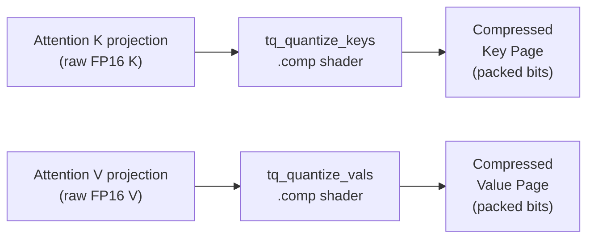
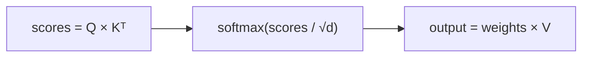
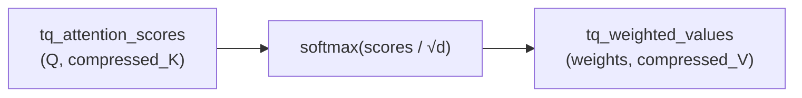

# TurboQuant KV Cache Compression — ZINC Implementation Spec

## Overview

TurboQuant (ICLR 2026) is a two-stage vector quantization algorithm that compresses LLM key-value caches to 2-4 bits per coordinate with minimal impact on attention accuracy. At 3-bit, a 289 MB KV cache (8K context, 36-layer model) shrinks to 58 MB — a 5x reduction that directly translates to longer contexts or more concurrent requests on the same GPU.

This spec describes how to implement TurboQuant as ZINC's KV cache compression layer, using Vulkan compute shaders on RDNA3/RDNA4 GPUs.

**Reference implementation:** `research/turboquant-pytorch-master/` (PyTorch, validated on Qwen2.5-3B)

**Paper:** "TurboQuant: Online Vector Quantization with Near-optimal Distortion Rate" (arXiv:2504.19874)

## Why TurboQuant for ZINC

ZINC's paged KV cache (SPEC.md §3.2) stores keys and values in FP16. For concurrent request serving — ZINC's primary use case — the KV cache is the VRAM bottleneck:

| GPU | VRAM | Model | FP16 KV @ 4 concurrent × 8K ctx | TQ-3bit KV |
|-----|------|-------|----------------------------------|------------|
| RX 9070 XT | 16 GB | Qwen3-8B Q4_K (~5 GB) | 4.6 GB | **0.9 GB** |
| RX 9070 XT | 16 GB | Llama-70B Q4_K (~40 GB) | Won't fit | Won't fit |
| AI PRO R9700 | 32 GB | Llama-70B Q4_K (~40 GB) | ~18 GB (⚠ tight) | **3.6 GB** |

With TurboQuant, the AI PRO R9700 goes from barely fitting 70B with 4 concurrent requests to having 10+ GB of headroom. The RX 9070 XT can serve 8+ concurrent 8K sessions on an 8B model instead of 4.

### Why not simpler quantization (round-to-nearest Q4/Q8)?

Naive per-channel quantization of KV cache introduces **biased** inner products. The attention mechanism computes $\text{softmax}(QK^\top)$ — biased scores shift the attention distribution, causing the model to attend to wrong tokens. TurboQuant's QJL correction makes the inner product estimator **mathematically unbiased** with variance $O(1/d)$, which is why it preserves 99.5% attention cosine similarity at 3-bit (validated on real Qwen2.5-3B data).

## Algorithm Summary

### Stage 1: Random Rotation + Lloyd-Max Quantization (MSE-optimal)

1. **Rotate** the vector by a fixed random orthogonal matrix $\Pi$: $\mathbf{y} = \Pi \mathbf{x}$
   - After rotation, each coordinate follows a known distribution $\approx \mathcal{N}(0, 1/d)$
   - Coordinates become nearly independent → enables per-coordinate scalar quantization
2. **Quantize** each coordinate to its nearest Lloyd-Max centroid (precomputed codebook)
3. **Store** the $(b-1)$-bit index per coordinate

### Stage 2: QJL Residual Correction (1 bit per coordinate)

1. **Reconstruct** from Stage 1: $\hat{\mathbf{x}}_{\text{mse}} = \Pi^\top \cdot \text{centroids}[\text{indices}]$
2. **Compute residual**: $\mathbf{r} = \mathbf{x} - \hat{\mathbf{x}}_{\text{mse}}$
3. **Project** residual through random Gaussian matrix $S$: $\text{projected} = S \mathbf{r}$
4. **Store sign bits**: $\text{signs} = \text{sign}(\text{projected})$ — exactly 1 bit per dimension
5. **Store** $\|\mathbf{r}\|$ as a single FP16 scalar per vector

### Asymmetric Inner Product (the attention kernel)

To compute $\langle \mathbf{q}, \mathbf{k} \rangle$ without decompressing:

$$\langle \mathbf{q}, \mathbf{k} \rangle \approx \langle \mathbf{q}, \hat{\mathbf{k}}_{\text{mse}} \rangle + \|\mathbf{r}_k\| \cdot \sqrt{\frac{\pi}{2}} \cdot \frac{1}{m} \cdot \langle S\mathbf{q},\, \text{signs}_k \rangle$$

- **Term 1**: standard $Q \times \hat{K}_{\text{mse}}^\top$ matmul
- **Term 2**: QJL correction — projects query through $S$, dot-products with stored signs

This estimator is **unbiased** regardless of bit-width. The variance decreases as $O(1/d)$.

### Value compression

Values only need MSE reconstruction (no inner product), so they use Stage 1 only at full b bits — no QJL overhead.

## Data Structures

### Precomputed Constants (per model, computed once at load time)

```zig
const TurboQuantConfig = struct {
    head_dim: u32,           // d (typically 128)
    bits: u32,               // total bit budget (2, 3, or 4)
    mse_bits: u32,           // bits - 1 (for keys) or bits (for values)
    n_levels: u32,           // 2^mse_bits
    qjl_dim: u32,            // projection dimension m (= head_dim)
};

// Per attention head (or shared across heads if same head_dim)
const TurboQuantMatrices = struct {
    Pi: VulkanBuffer,        // (d × d) f32 — random orthogonal rotation
    Pi_T: VulkanBuffer,      // (d × d) f32 — transpose, for unrotation
    S: VulkanBuffer,         // (m × d) f32 — QJL projection matrix (keys only)
    centroids: VulkanBuffer, // (n_levels,) f32 — Lloyd-Max codebook
};
```

**Memory cost of constants** (d=128, 3-bit):
- Pi: 128 × 128 × 4 = 64 KB per unique seed
- S: 128 × 128 × 4 = 64 KB per unique seed
- Centroids: 4 values × 4 bytes = 16 bytes
- Total per layer: ~256 KB (two heads typical for GQA) — negligible

### Compressed KV Pages

The existing paged KV cache (16-token pages) gets a compressed variant:

```zig
// Compressed key page — Stage 1 + Stage 2
const CompressedKeyPage = struct {
    mse_indices: VulkanBuffer,   // (16 × d) packed bits — (b-1) bits per coordinate
    qjl_signs: VulkanBuffer,     // (16 × m) packed bits — 1 bit per coordinate
    residual_norms: VulkanBuffer, // (16,) f16 — one norm per vector
    vec_norms: VulkanBuffer,      // (16,) f16 — original vector norms (for normalization)
};

// Compressed value page — Stage 1 only (MSE)
const CompressedValuePage = struct {
    mse_indices: VulkanBuffer,   // (16 × d) packed bits — b bits per coordinate
    vec_norms: VulkanBuffer,      // (16,) f16 — original vector norms
};
```

### Compressed Page Memory Per Token (d=128)

| Component | 2-bit | 3-bit | 4-bit |
|-----------|-------|-------|-------|
| **Key MSE indices** | 1×128 = 128 bits | 2×128 = 256 bits | 3×128 = 384 bits |
| **Key QJL signs** | 128 bits | 128 bits | 128 bits |
| **Key residual norm** | 16 bits | 16 bits | 16 bits |
| **Key vec norm** | 16 bits | 16 bits | 16 bits |
| **Key total** | 288 bits (36 B) | 416 bits (52 B) | 544 bits (68 B) |
| **Value MSE indices** | 2×128 = 256 bits | 3×128 = 384 bits | 4×128 = 512 bits |
| **Value vec norm** | 16 bits | 16 bits | 16 bits |
| **Value total** | 272 bits (34 B) | 400 bits (50 B) | 528 bits (66 B) |
| **K+V total** | 70 B | 102 B | 134 B |
| **FP16 K+V** | 512 B | 512 B | 512 B |
| **Compression** | **7.3×** | **5.0×** | **3.8×** |

## Vulkan Compute Shaders

### Shader 1: `tq_quantize_keys.comp` — Key Compression

Runs during prefill and each decode step, compressing newly generated K vectors.

```glsl
// Inputs:
//   keys: (batch, head_dim) f16 — raw key vectors from attention projection
//   Pi_T: (d, d) f32 — rotation matrix transpose (Pi^T, used as: rotated = x @ Pi^T = Pi @ x)
//   S: (m, d) f32 — QJL projection matrix
//   centroids: (n_levels,) f32 — Lloyd-Max codebook
//
// Outputs:
//   mse_indices: (batch, head_dim) uint8 packed — (b-1) bits per coord
//   qjl_signs: (batch, qjl_dim) uint32 packed — 1 bit per coord
//   residual_norms: (batch,) f16
//   vec_norms: (batch,) f16

layout(local_size_x = 64) in;  // wave64 on RDNA4

void main() {
    uint vec_id = gl_WorkGroupID.x;

    // Step 1: Load key vector, compute and store norm, normalize
    // Step 2: Rotate — y = normalized_key @ Pi^T (each thread handles d/64 coords)
    // Step 3: Quantize — for each coord, find nearest centroid index
    // Step 4: Dequantize in rotated space, unrotate to get k_mse
    // Step 5: Compute residual = original_key - k_mse
    // Step 6: Project residual through S, store sign bits
    // Step 7: Compute and store ||residual||
    // Step 8: Pack indices and signs into output buffers
}
```

**Workgroup strategy**: One workgroup per key vector. With wave64, a single wave handles all 128 coordinates (128/64 = 2 coords per thread). The rotation is a matmul of a single vector by a d×d matrix — each thread computes 2 output coordinates by dot-producting across d=128 inputs using shared memory.

**Performance estimate**: The bottleneck is the two d×d matmuls (rotate + project). For d=128: 2 × 128 × 128 = 32K FMAs per vector. At RDNA4's ~61 TFLOPS, one vector takes ~0.5 μs. For a 16-token page, ~8 μs — negligible vs. the attention matmul.

### Shader 2: `tq_quantize_values.comp` — Value Compression

Same as keys but MSE-only (no QJL). Simpler and faster.

```glsl
// Inputs: values (batch, head_dim) f16, Pi_T, centroids
// Outputs: mse_indices (packed bits), vec_norms (f16)

layout(local_size_x = 64) in;

void main() {
    // Step 1: Load, normalize
    // Step 2: Rotate
    // Step 3: Quantize to nearest centroid
    // Step 4: Pack indices
}
```

### Shader 3: `tq_attention_scores.comp` — Asymmetric Attention

The critical path shader. Computes attention scores directly from compressed keys without decompression.

```glsl
// Inputs:
//   queries: (n_queries, head_dim) f16 — current token queries
//   key_pages[]: compressed key pages (indices, signs, norms)
//   Pi, S, centroids — precomputed constants
//
// Output:
//   scores: (n_queries, seq_len) f32 — attention logits

layout(local_size_x = 64) in;  // wave64

// Each workgroup computes one query's scores against a page of 16 keys
void main() {
    uint query_id = gl_WorkGroupID.x;
    uint page_id = gl_WorkGroupID.y;

    // For each key in page:
    //   Term 1: Dequantize key MSE indices -> k_mse, dot with query
    //     - Look up centroids[indices] -> rotated reconstruction
    //     - Unrotate: k_mse_coord = sum(Pi[i][j] * centroid[j]) — fused with dot product
    //     - Optimization: <q, Pi^T @ c> = <Pi @ q, c> — rotate query ONCE, then dot with centroids directly
    //
    //   Term 2: QJL correction
    //     - <S @ q, signs_k> — project query once, dot with stored signs (1-bit × f32)
    //     - Scale by ||r_k|| * sqrt(pi/2) / m
    //
    //   scores[query_id][page_offset + key_idx] = term1 + term2
}
```

**Key optimization — rotate the query instead of the keys:**

The inner product $\langle \mathbf{q},\, \Pi^\top \cdot \text{centroids}[\text{idx}] \rangle$ can be rewritten as $\langle \Pi \mathbf{q},\, \text{centroids}[\text{idx}] \rangle$. We rotate each query **once** (128 FMAs), then dot the rotated query directly with the centroid values. This avoids decompressing each key entirely — we just look up centroid values and accumulate.

Similarly for QJL: $\langle S\mathbf{q},\, \text{signs} \rangle$ — project the query once, then dot with stored sign bits.

**Performance estimate per query × page (16 keys, d=128, 3-bit):**
- Rotate query: 128 × 128 = 16K FMAs (once)
- Project query through S: 128 × 128 = 16K FMAs (once)
- Per key: 128 centroid lookups + 128 FMAs (term1) + 128 sign-multiply-accumulates (term2) = ~256 FMAs
- 16 keys: 256 × 16 = 4K FMAs
- Total: ~36K FMAs per query-page pair
- FP16 equivalent: 128 × 16 = 2K FMAs per query-page — TurboQuant is ~18× more compute

This compute overhead is acceptable because:
1. Decode attention is memory-bound, not compute-bound (bandwidth utilization is 67-93%)
2. The 5× memory reduction means more KV cache fits in fast L2/VRAM
3. For long contexts (8K+), the reduced memory traffic outweighs the extra ALU

### Shader 4: `tq_decompress_values.comp` — Value Reconstruction

After attention scores are computed and softmax applied, reconstruct values for the weighted sum.

```glsl
// Inputs: value page indices, centroids, Pi, vec_norms, attention_weights
// Output: attention output (head_dim,) per query

layout(local_size_x = 64) in;

void main() {
    // For each value in page:
    //   Dequantize: look up centroids, unrotate, scale by vec_norm
    //   Multiply by attention weight
    //   Accumulate into output
    //
    // Optimization: fuse dequantize with weighted accumulation
    // No need to fully decompress all values — only process pages with non-negligible weights
}
```

### Shader 5: `tq_codebook_init.comp` — Lloyd-Max Solver (one-time)

Runs once at model load. Computes optimal quantization centroids for the given head dimension.

The Lloyd-Max algorithm iterates:
1. Set boundaries = midpoints between adjacent centroids
2. Set centroids = conditional expectations $\mathbb{E}[X \mid X \in \text{partition}]$

For $d \geq 64$, the coordinate distribution is well-approximated by $\mathcal{N}(0, 1/d)$. The solver converges in ~50–100 iterations. This can run on CPU at load time since it produces only $2^b$ float values.

**Implementation**: Compute on CPU in Zig using numerical integration (trapezoidal rule is sufficient — the integrands are smooth Gaussians). Store results in a small GPU buffer.

```zig
fn solveLloydMax(d: u32, bits: u32) struct { centroids: [16]f32, boundaries: [15]f32 } {
    const n_levels = @as(u32, 1) << bits;
    const sigma = 1.0 / @sqrt(@as(f32, @floatFromInt(d)));

    // Gaussian PDF: (1/sqrt(2*pi*sigma^2)) * exp(-x^2 / (2*sigma^2))
    // Iterate: boundaries = midpoints, centroids = conditional means
    // Converges in ~100 iterations to machine precision
}
```

### Shader 6: `tq_rotation_init.comp` — Matrix Generation (one-time)

Generate the random orthogonal matrix Pi via QR decomposition of a Gaussian matrix. Also runs once at model load.

**Implementation**: CPU-side in Zig. Generate d×d Gaussian random matrix, compute QR decomposition (Householder reflections), fix sign ambiguity. Upload Pi and Pi^T to GPU buffers.

```zig
fn generateRotationMatrix(d: u32, seed: u64, allocator: Allocator) ![]f32 {
    // 1. Seed PRNG with layer_index * 1000 + head_index
    // 2. Generate d×d matrix of N(0,1) values
    // 3. QR decomposition via Householder reflections
    // 4. Fix signs: Q = Q * diag(sign(diag(R)))
    // 5. Return Q as row-major f32 array
}
```

## Integration with ZINC Architecture

### Modified KV Cache Page Table

The existing page table (SPEC.md §3.2) extends to support both FP16 and compressed formats:

```zig
const KVPageFormat = enum {
    fp16,           // Uncompressed (used for first few tokens or when VRAM is plentiful)
    turboquant_2bit,
    turboquant_3bit,
    turboquant_4bit,
};

const KVPage = struct {
    format: KVPageFormat,
    // Union of FP16 page and compressed page buffers
    data: union {
        fp16: struct {
            keys: VulkanBuffer,    // (page_size × head_dim) f16
            values: VulkanBuffer,  // (page_size × head_dim) f16
        },
        compressed: struct {
            key_mse_indices: VulkanBuffer,
            key_qjl_signs: VulkanBuffer,
            key_residual_norms: VulkanBuffer,
            key_vec_norms: VulkanBuffer,
            value_mse_indices: VulkanBuffer,
            value_vec_norms: VulkanBuffer,
        },
    },
};
```

### Compression Pipeline (per decode step)



### Modified Attention Pipeline

**Standard attention:**



**TurboQuant attention (no decompression):**



### Prefill vs Decode Strategy

**Prefill** (processing the prompt, compute-bound):
- Process all prompt tokens through attention with FP16 KV
- After the prefill forward pass, compress the KV cache in one batch
- The compression cost is amortized: ~8 μs per 16 tokens = ~4 ms for 8K context
- This is small relative to prefill compute (~50-200 ms for 8K on RDNA4)

**Decode** (generating tokens, memory-bound):
- Each new K,V vector is compressed immediately after projection
- Attention reads from compressed cache — 5× less memory traffic
- The per-token compression cost (~0.5-1 μs per head per layer) is negligible

### Configuration

```zig
const TurboQuantOptions = struct {
    enabled: bool = false,
    key_bits: u32 = 3,       // 2, 3, or 4 — keys use (bits-1) for MSE + 1 for QJL
    value_bits: u32 = 3,     // 2, 3, or 4 — values use full bits for MSE
    min_seq_compress: u32 = 32, // Don't compress very short sequences (overhead not worth it)
};
```

Exposed via CLI:

```
./zinc -m model.gguf --kv-quant 3       # 3-bit TurboQuant (recommended)
./zinc -m model.gguf --kv-quant 4       # 4-bit (higher quality, less compression)
./zinc -m model.gguf --kv-quant 0       # Disabled, FP16 KV (default)
```

## Bit Packing Layout

Efficient GPU-friendly packing for quantized indices.

### 2-bit MSE indices (4 values per byte)

```
byte[i] = idx[4i+0] | (idx[4i+1] << 2) | (idx[4i+2] << 4) | (idx[4i+3] << 6)
```

For d=128: 128 × 2 bits = 256 bits = 32 bytes = 8 uint32s per vector.

### 3-bit MSE indices (packed into 32-bit words)

```
// 10 values per 32-bit word (10 × 3 = 30 bits, 2 bits unused)
word[i] = idx[10i+0] | (idx[10i+1] << 3) | ... | (idx[10i+9] << 27)
```

For d=128: 128 × 3 bits = 384 bits = 13 uint32s per vector (with 2 bits padding in last word).

### 1-bit QJL signs (32 values per uint32)

```
word[i] = sign_bit[32i+0] | (sign_bit[32i+1] << 1) | ... | (sign_bit[32i+31] << 31)
```

For d=128: 128 bits = 4 uint32s per vector.

### GPU-friendly alignment

Each vector's packed data is aligned to 16 bytes (4 uint32s) for coalesced memory access. Padding is added where needed.

| Component | 2-bit | 3-bit | 4-bit | Alignment |
|-----------|-------|-------|-------|-----------|
| MSE indices | 32 B (8 × u32) | 48 B (12 × u32, padded) | 64 B (16 × u32) | 16 B |
| QJL signs | 16 B (4 × u32) | 16 B (4 × u32) | 16 B (4 × u32) | 16 B |
| Residual norm | 2 B (f16) | 2 B (f16) | 2 B (f16) | Packed with vec_norm |
| Vec norm | 2 B (f16) | 2 B (f16) | 2 B (f16) | Packed with residual |

## Implementation Phases

### Phase A: Offline Codebook + Rotation Generation (CPU, Zig)

**Deliverables:**
1. `src/turboquant/lloyd_max.zig` — Lloyd-Max solver using Gaussian approximation
   - Trapezoidal numerical integration for E[X | X in partition]
   - Produces `[n_levels]f32` centroids for given d and bits
   - Unit test: compare centroids against PyTorch reference values

2. `src/turboquant/rotation.zig` — Random orthogonal matrix generation
   - Gaussian RNG (Ziggurat or Box-Muller from `std.Random`)
   - Householder QR decomposition (d × d, in-place)
   - Sign correction on diagonal of R
   - Unit test: verify orthogonality (Pi @ Pi^T ≈ I)

3. `src/turboquant/qjl.zig` — QJL projection matrix generation
   - d × m matrix of N(0,1) values from seeded PRNG
   - Upload to VulkanBuffer

**Validation:** Generate codebooks and matrices, compare against PyTorch reference implementation values for same seeds.

### Phase B: Key/Value Compression Shaders

**Deliverables:**
1. `src/shaders/tq_quantize_keys.comp` — Full key compression pipeline
2. `src/shaders/tq_quantize_values.comp` — MSE-only value compression
3. `src/turboquant/compress.zig` — Zig dispatch code (buffer management, push constants)

**Validation:**
- Compress random vectors on GPU, download, compare MSE against PyTorch reference
- Verify bit-packing roundtrip: pack → unpack → values match
- Measure compression throughput (target: >1M vectors/sec on RDNA4)

### Phase C: Asymmetric Attention Shader

**Deliverables:**
1. `src/shaders/tq_attention_scores.comp` — Asymmetric Q × compressed_K scores
2. `src/shaders/tq_decompress_values.comp` — Weighted value reconstruction
3. Integration with existing flash attention pipeline

**Validation:**
- Compare attention scores against FP16 baseline: cosine similarity >0.995 at 3-bit
- Inner product bias test: mean error < 0.001 over 10K random vectors
- Needle-in-haystack: exact top-1 retrieval at 3-bit for seq_len up to 8K

### Phase D: Integration with KV Cache + Scheduler

**Deliverables:**
1. Modified `KVPage` struct with compressed variant
2. Compression hook in decode loop (compress after K,V projection)
3. Modified attention dispatch to use asymmetric shaders when pages are compressed
4. CLI flag `--kv-quant` to enable

**Validation:**
- End-to-end generation test: load GGUF model, generate text, compare perplexity with/without TQ
- Memory measurement: verify actual VRAM savings match theoretical compression ratios
- Concurrent request test: verify 4× concurrent with TQ-3bit where FP16 would OOM

### Phase E: Optimization

**Deliverables:**
1. Fuse rotation + quantize into single shader pass (avoid intermediate buffer)
2. Fuse dequant + attention score into single shader (the "rotate query" optimization)
3. Page-level compression batching (compress 16 tokens at once for better GPU utilization)
4. Selective compression: keep recent tokens in FP16 (sliding window), compress older pages
5. Profile and tune workgroup sizes for RDNA4

## Risks and Mitigations

| Risk | Impact | Mitigation |
|------|--------|------------|
| Rotation matmul overhead per token | +10-15% decode latency | Fuse with attention; rotate query not key |
| QR decomposition precision in Zig | Wrong rotation → bad quantization | Validate against PyTorch reference with same seeds |
| 3-bit packing complexity on GPU | Complex bit manipulation in shaders | Start with 2-bit and 4-bit (power-of-2 aligned), add 3-bit after |
| Memory allocation for compressed pages | Fragmentation with mixed FP16/TQ pages | Uniform page size; pad compressed pages to match alignment |
| Accuracy degradation on some model architectures | Some models may be more sensitive to KV quantization | Make TQ optional with quality presets; default to 4-bit for conservative use |

## File Structure

```
src/
  turboquant/
    lloyd_max.zig        # Codebook solver
    rotation.zig         # Orthogonal matrix generation (QR decomposition)
    qjl.zig              # QJL projection matrix generation
    compress.zig         # GPU compression dispatch
    config.zig           # TurboQuantOptions, CLI parsing
  shaders/
    tq_quantize_keys.comp      # Key compression (rotation + LM quantize + QJL)
    tq_quantize_values.comp    # Value compression (rotation + LM quantize)
    tq_attention_scores.comp   # Asymmetric Q × compressed_K
    tq_decompress_values.comp  # Weighted value reconstruction from compressed V
```
