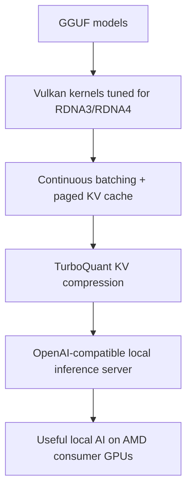

If you want to run serious local AI on an AMD consumer GPU today, the story is still far worse than it should be. The hardware is real. The demand is real. The open models are finally good enough to matter. But the software stack still feels fragmented, fragile, and too often built around the assumption that NVIDIA is the only platform worth taking seriously.

That gap is why I decided to build [ZINC](https://github.com/zolotukhin/zinc).

ZINC is an inference engine for AMD RDNA3 and RDNA4 GPUs, built with [Zig](https://ziglang.org/) and [Vulkan](https://www.vulkan.org/) compute. At a technical level, it is about hand-tuned GPU kernels, [GGUF](https://github.com/ggml-org/ggml/blob/master/docs/gguf.md) model loading, paged KV cache, continuous batching, and [TurboQuant](https://research.google/blog/turboquant-redefining-ai-efficiency-with-extreme-compression/) KV compression. At a higher level, the mission is simpler: make AMD consumer GPUs genuinely useful for local LLM inference, not as a second-best fallback, but as a first-class target.

I think this matters much more than it may appear at first. Local AI is moving out of the demo phase and into real daily use. Developers want private inference, lower cost, predictable latency, and control over the full stack. Teams want an OpenAI-compatible API they can run on their own hardware. Hobbyists want to do meaningful work without buying datacenter gear. And there are a lot of capable AMD GPUs sitting in desktops right now that should be able to do far more than the current software allows.

## The problem is not the hardware

The most important thing to understand about ZINC is that this is not a project built around a fantasy that AMD hardware will somehow become good one day. The hardware is already good enough to justify serious software work.

RDNA4 cards have the bandwidth, the compute, and the memory hierarchy to run modern inference workloads well. On the [AI PRO R9700](https://www.amd.com/en/products/graphics/workstations/radeon-ai-pro/ai-9000-series/amd-radeon-ai-pro-r9700.html), the target for ZINC is 110+ tokens per second on [Qwen3.5-35B-A3B](https://huggingface.co/collections/Qwen/qwen3) Q4_K, with 90%+ memory bandwidth utilization on the critical decode matmul path. Even before ZINC exists end to end, the profiling work is already telling a clear story: the limiting factor is not that AMD consumer GPUs are incapable. The limiting factor is that the software stack around them is still too thin.

Under the hood, the RDNA4 chip (gfx1201) is a well-documented architecture. AMD publishes the full [RDNA 4 Instruction Set Architecture reference](https://www.amd.com/content/dam/amd/en/documents/radeon-tech-docs/instruction-set-architectures/rdna4-instruction-set-architecture.pdf) — every ALU opcode, every memory instruction, every wavefront scheduling rule is in there. That level of openness is what makes a project like ZINC possible. We can read the ISA, understand exactly how wave64 dispatch maps onto 64 compute units with 32 KB of L1 per CU and 6 MB of shared L2, and write shaders that work *with* the hardware instead of around it. ZINC's [RDNA4 tuning notes](/zinc/docs/RDNA4_TUNING) and [TurboQuant spec](/zinc/docs/TURBOQUANT_SPEC) are built directly on top of this documentation.

That is the opening. When a platform is strong enough in hardware but weak in software, a focused systems project can matter a lot.

## Why ZINC exists now

The timing is unusually good.

First, local LLM inference has become a real workload instead of a niche curiosity. Open models are improving fast, quantization is getting better, and more developers want to run models close to their data and workflows. Second, AMD consumer GPUs remain underserved by the dominant AI software ecosystem. [ROCm](https://rocm.docs.amd.com/) still does not treat RDNA3 and RDNA4 consumer cards as the primary target, while Vulkan works across the hardware people actually own. Third, the algorithmic side is finally catching up to the hardware side. Techniques like [TurboQuant](https://arxiv.org/abs/2504.19874) can cut KV cache memory by around 5x at 3-bit while preserving attention quality, which directly changes what fits on a 16 GB or 32 GB card.

ZINC is not the only project that sees this opening. [tinygrad](https://github.com/tinygrad/tinygrad) and the [tinybox](https://tinygrad.org/#tinybox) have been proving the same core thesis from the training side: AMD consumer GPUs can compete when paired with the right software, and George Hotz's team has gone as far as rewriting drivers from scratch to bypass CUDA lock-in. Their work helps validate the premise. ZINC approaches the same gap from the inference side — purpose-built for serving open models locally.

Those three things together create a very unusual window. There is now enough demand, enough hardware capability, and enough technical leverage to build something much better than another narrow benchmark demo.

ZINC is not just a kernel experiment. It is a full stack designed to turn AMD consumer GPUs into practical local AI servers.

What matters in this diagram is the shape of the ambition. I am not interested in building a single fast shader and calling the problem solved. The real value comes from connecting the whole path, from model loading to serving, so the end result is usable by actual developers and teams.

## The mission

The mission of ZINC is to make local LLM inference on AMD consumer GPUs fast, correct, and deployable.

Fast means the kernels need to be tuned for the actual architecture, not abstracted into something so generic that all performance disappears. That is why ZINC is being built around [Vulkan compute](https://www.vulkan.org/), hand-written GLSL shaders, and RDNA-specific tuning choices like wave64 and architecture-aware memory behavior.

Correct means the outputs need to line up with trusted references, the memory system needs to hold up under pressure, and optimizations cannot quietly break model quality. If ZINC says a kernel is working, that should be backed by cosine similarity checks against reference implementations, not wishful thinking.

Deployable means this project cannot stop at a CLI toy. The goal is an OpenAI-compatible server with continuous batching, paged KV cache, streaming responses, and the operational shape people already know how to integrate. If a team can point its existing client at ZINC and get local inference on AMD hardware, the project becomes much more than an experiment.

## Where ZINC can be different

A lot of inference projects are forced to choose between being fast in a benchmark and being useful in production. ZINC only matters if it does both.

That is why the architecture is full-stack by design. It starts with direct [GGUF](https://github.com/ggml-org/ggml/blob/master/docs/gguf.md) loading, because that is where the open model ecosystem already is (thanks to [llama.cpp](https://github.com/ggml-org/llama.cpp)). It includes continuous batching, because single-request speed is not enough if the real goal is serving. It includes [paged KV cache](https://arxiv.org/abs/2309.06180), because memory management is a first-order problem once concurrency enters the picture. And it includes TurboQuant, because VRAM is the hard wall on 16 GB and 32 GB cards.

The last point is especially important. On paper, many systems look workable until you ask them to serve several concurrent 8K-context sessions. Then the KV cache becomes the story. In ZINC's current design targets, TurboQuant at 3-bit shrinks K+V cache footprint by about 5x. On an RX 9070 XT with a Qwen3-8B Q4_K-class model, that is the difference between roughly four concurrent 8K sessions with FP16 KV and eight or more with compressed KV. That is not a cosmetic improvement. That changes whether a consumer card feels limited or actually useful.

## Why I think ZINC can be a huge success

I do not think ZINC will succeed because the branding is good or because local AI is trendy. I think it can succeed because the gap is specific, the target user is clear, and the technical plan is grounded in the actual bottlenecks.

| Problem today | Why it matters | ZINC response |
| --- | --- | --- |
| AMD consumer GPUs are underserved by mainstream AI stacks | A lot of real hardware is left underused | Build directly for RDNA3 and RDNA4 with Vulkan |
| Local inference tools often optimize for single-user demos | Real usage needs concurrent serving | Make continuous batching and paged KV core features |
| VRAM becomes the limit long before interest does | 16 GB and 32 GB cards hit context and concurrency walls fast | Use TurboQuant to reduce KV cache footprint by around 5x at 3-bit |
| Integration friction kills adoption | Teams already have clients that speak the OpenAI API | Expose an OpenAI-compatible server from day one |

This table is the core business logic of the project. Each row maps a real constraint to a concrete systems decision. That is the kind of foundation a serious open-source project needs if it wants to become durable.

There is also a strong flywheel here. If ZINC makes AMD local AI easier to use, more people will actually run models on AMD hardware. That leads to more testing, more bug reports, more benchmarks, more contributors, better model coverage, and a much stronger public case that this platform is worth supporting well. Projects get big when they make an ignored group suddenly productive. That is exactly the opportunity here.

There is also a broader reason I think this can work: the people who need this are easy to identify. They are developers with AMD cards, researchers who care about efficient inference, teams that want private deployment, open-source contributors who enjoy low-level performance work, and builders who are tired of hearing that local AI only counts if it runs on the most expensive stack in the room.

## Why contributors should care

ZINC is the kind of project where contributions can have outsized leverage.

If you improve a kernel, you are not shaving a few milliseconds off a synthetic number for bragging rights. You are helping a real class of GPUs become more useful for real workloads. If you improve the scheduler, memory management, model support, docs, validation, or deployment path, you are helping move AMD local AI from "interesting if you are stubborn enough" to "practical by default."

There is also a lot of room here for different kinds of contributors. Some people will care about Vulkan kernels and GPU tuning. Some will care about Zig systems work, GGUF parsing, testing, or API compatibility. Some will care about quantization research, especially around KV compression and inference quality. Some will care about docs, packaging, and turning a sharp system into something more people can actually use. All of that work matters.

The best open-source projects tend to win when the technical challenge is real, the user need is obvious, and contributors can see how their work compounds. ZINC has that shape.

## What success would look like

Success for ZINC is not a benchmark screenshot with no follow-through. Success is much more concrete.

It means a developer can load a GGUF model on an RDNA4 card, hit an OpenAI-compatible endpoint, and get fast, correct, streaming responses without fighting the stack. It means a 16 GB AMD consumer GPU can handle workloads that currently feel awkward or out of reach. It means a 32 GB card can serve bigger models with enough headroom to be genuinely useful. It means AMD local inference becomes a category people take seriously instead of an exception people apologize for.

If that happens, ZINC will not just be another inference engine. It will become a proof point that the local AI stack does not need to stay narrow, centralized, or locked to one hardware story.

## What comes next

I am building ZINC because I think the next wave of local AI infrastructure will be won by projects that are brutally practical. The winners will load the models people already use, run on the hardware people already own, expose the APIs people already integrate, and attack the real bottlenecks instead of hiding from them.

That is the bet here.

If you care about local LLM inference, AMD GPUs, Vulkan compute, Zig, KV cache compression, or building serious open infrastructure around open models, I want your help. ZINC has a clear mission, a hard technical core, and a real reason to exist right now. That combination is rare.

I think it can become a huge success because it is aimed at a real gap, not an invented one. And if we get this right, a lot more people will be able to do meaningful AI work on hardware they can actually afford.
