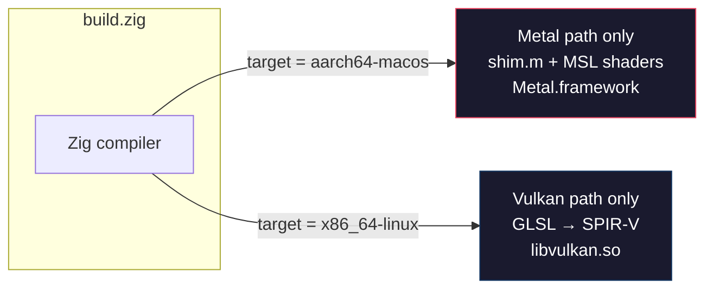
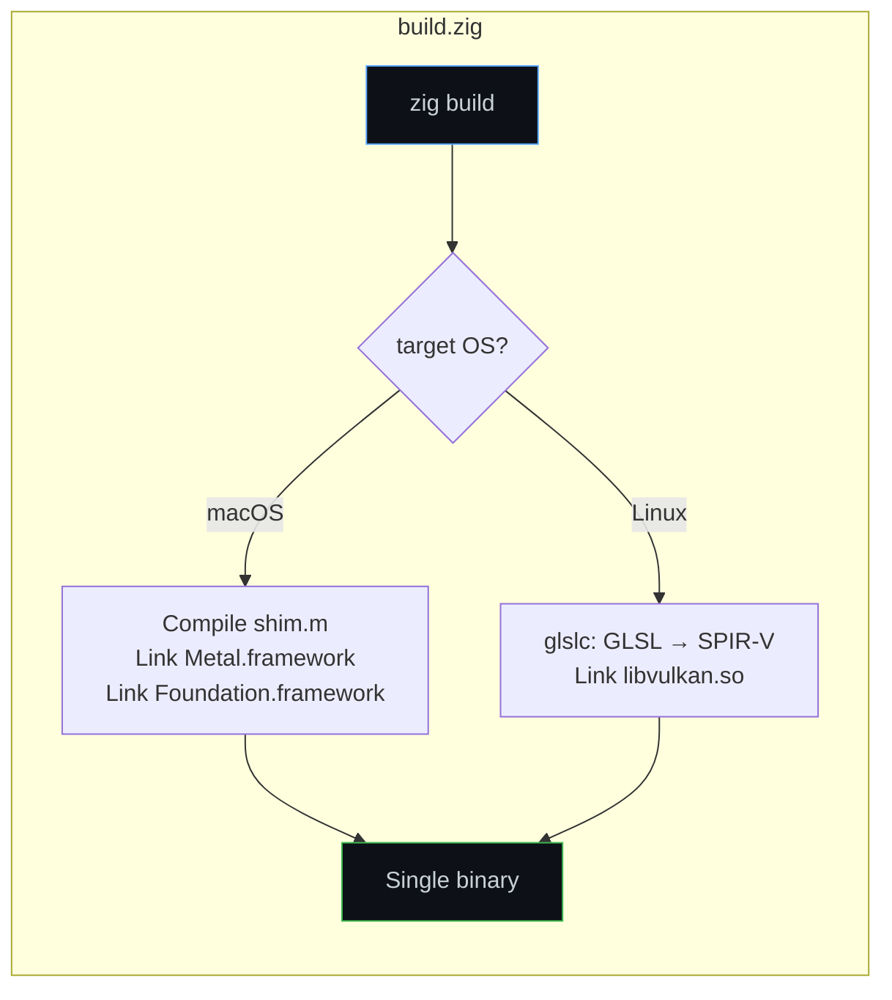
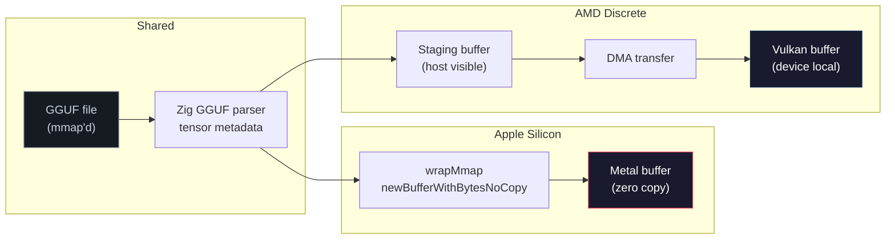

We did not pick Zig because it was trendy. We picked it because we had a gut feeling that language choice would matter more than any single optimization we could write. Seven weeks and two GPU backends later, that gut feeling turned into a conviction.

ZINC runs the same LLM inference engine on [AMD GPUs through Vulkan](/blog/2026-03-25-why-we-are-building-zinc) and on [Apple Silicon through Metal](/blog/2026-04-01-bringing-zinc-to-apple-silicon). Not two engines. Not a compatibility layer. One codebase, two backends, zero runtime cost to switch between them. The reason that works is Zig.

This post is about the moments where the language saved us, the patterns that make GPU programming in Zig surprisingly pleasant, and the honest realization that if we had started this in C++, we would still be writing [CMakeLists](https://cmake.org/cmake/help/latest/manual/cmake-language.7.html).

## One `if` decides the entire backend

Here is the core of our GPU abstraction. This is the entire file:

```zig
const builtin = @import("builtin");

pub const is_metal = builtin.os.tag == .macos;
pub const is_vulkan = builtin.os.tag == .linux;

pub const backend = if (is_metal)
    @import("../metal/device.zig")
else
    @import("../vulkan/instance.zig");
```

Six lines. No vtable. No runtime dispatch. No abstract factory pattern. When you compile on macOS, the Vulkan code does not exist. When you compile on Linux, Metal does not exist. The compiler strips the unused path entirely, as if you wrote a Metal-only or Vulkan-only engine from scratch.

This is [comptime](https://ziglang.org/documentation/master/#comptime) at work. The `if` evaluates during compilation. The `@import` on the dead branch never triggers. You get the ergonomics of a cross-platform abstraction with the codegen of a handwritten single-backend binary.

In C++, you would need `#ifdef`, or a build-system flag that sets a macro, or a runtime plugin system. Each of those adds a surface where bugs hide. In Zig, the compiler understands your branching and proves it correct before emitting a single instruction. Andrew Kelley's [talk on the road to Zig 1.0](https://www.youtube.com/watch?v=Unq770vRuV4) covers why this design was chosen over alternatives.



Every function call through `backend` is a direct call. The optimizer sees through it completely. There is zero indirection penalty.

## The one Objective-C file

[Metal](https://developer.apple.com/metal/) is an Apple framework. It speaks Objective-C. Our entire project is Zig. That sounds like a problem.

It is not.

We wrote exactly one `.m` file. It is a thin C-callable shim that wraps every Metal operation we need: device creation, buffer allocation, pipeline compilation, command encoding, dispatch. The shim exposes pure C function signatures. Zig [imports them like any other C header](https://ziglang.org/documentation/master/#cImport) because Zig has first-class C interop built into the language.

```zig
// Zig calls into Metal through plain C functions
const ctx = shim.mtl_init();
if (ctx == null) return error.MetalInitFailed;
```

On the Objective-C side, ARC (automatic reference counting) handles memory. On the Zig side, we treat the returned pointer as an opaque handle and track its lifetime with `defer`:

```zig
const device = try MetalDevice.init(allocator, 0);
defer device.deinit();
// Everything between here and the end of scope is guaranteed cleanup
```

No bridging headers. No Objective-C++. No `@autoreleasepool` blocks leaking into business logic. The entire Objective-C surface is 400 lines of C-shaped wrapper code, and nothing outside that file knows it exists.

Compare this to what Metal integration looks like in a C++ codebase. You either pull in Objective-C++ (which means every file that touches Metal becomes `.mm`), or you build an elaborate C wrapper with manual reference counting. We did the second option, but Zig made the wrapper so thin that it barely registers as complexity. The [Apple Silicon blog post](/blog/2026-04-01-bringing-zinc-to-apple-silicon) has more detail on how this shim evolved during the Metal port.

## The build system that builds shaders

Here is something that surprised us. [Zig's build system](https://ziglang.org/documentation/master/#Zig-Build-System) handles our entire cross-platform compilation, including GPU shaders, in a single `build.zig`:

```zig
// Compile GLSL shaders to SPIR-V (Linux only)
if (compile_shaders) {
    inline for (shader_sources) |name| {
        const cmd = b.addSystemCommand(&.{
            "glslc",
            "--target-env=vulkan1.3",
            "-O",
            "-o",
        });
        cmd.addFileArg(b.path("src/shaders/" ++ name ++ ".spv"));
        cmd.addFileArg(b.path("src/shaders/" ++ name ++ ".comp"));
    }
}

// Link Metal frameworks (macOS only)
if (is_macos) {
    exe_mod.addCSourceFile(.{
        .file = b.path("src/metal/shim.m"),
        .flags = &.{ "-fobjc-arc", "-fmodules" },
    });
    exe_mod.linkFramework("Metal", .{});
    exe_mod.linkFramework("Foundation", .{});
}
```

The `inline for` is key. It unrolls at compile time, generating a separate build step for every shader file in the list. Add a new shader, add its name to the array, done. No CMake glob. No external script. No Makefile that generates another Makefile.

On macOS, the build links Metal.framework and compiles our single Objective-C file with ARC enabled. On Linux, it invokes `glslc` to turn GLSL into SPIR-V and links `libvulkan`. Both paths live in the same file, guarded by the same `is_macos` / `is_linux` checks we use everywhere.



We went from zero to "shaders compile, frameworks link, binary runs on both platforms" in an afternoon. The build system just worked. That is not something you say often in systems programming.

## Errors that actually help

GPU programming has a reputation for silent corruption. You write to the wrong buffer offset, and the output is garbage, but nothing crashes. You dispatch with the wrong workgroup size, and the shader reads uninitialized memory. Good luck debugging that at 3 AM. We [cataloged 13 bugs](/blog/2026-03-27-what-broke-first-when-we-built-zinc-on-amd-rdna4) in our first working forward pass, and most of them were exactly this kind of silent failure.

Zig's error handling does not magically fix GPU bugs. But it creates a culture in the codebase where every failure point is explicit.

```zig
pub fn wrapMmap(ctx: ?*shim.MetalCtx, ptr: [*]u8, size: usize) !MetalBuffer {
    const handle = shim.mtl_wrap_mmap(ctx, ptr, size);
    if (handle == null) return error.MetalMmapWrapFailed;
    return .{
        .handle = handle,
        .size = size,
        .cpu_ptr = ptr,
        .is_mmap_wrapped = true,
    };
}
```

That `!MetalBuffer` return type is an error union. It means "this function either gives you a MetalBuffer or tells you exactly what went wrong." There is no silent null. There is no exception that unwinds through 12 stack frames before someone catches it. The caller must handle both cases, or explicitly `try` to propagate the error upward.

When we had a bug where a memory-mapped region was not page-aligned, the error surfaced immediately at the call site:

```zig
// This fails with error.MetalMmapWrapFailed
// and the Objective-C shim prints: "mmap pointer not page-aligned"
var gpu_buffer = try metal_buffer.wrapMmap(device_ctx, unaligned_ptr, size);
```

No silent corruption. No garbage output two layers later. The error appeared exactly where the mistake was made.

## No allocator, no allocation

Zig does not have a default allocator. If a function needs heap memory, it takes an `std.mem.Allocator` parameter. If it does not take one, it does not allocate. This is a guarantee enforced by the type system.

For GPU programming, this matters more than it sounds.

```zig
pub const MetalDevice = struct {
    ctx: ?*shim.MetalCtx,
    chip: GpuFamily,
    caps: MetalCapabilities,
    allocator: std.mem.Allocator,

    pub fn deinit(self: *MetalDevice) void {
        if (self.ctx) |c| shim.mtl_deinit(c);
        self.* = undefined;
    }
};
```

Every struct that owns resources takes an allocator at init and frees through the same allocator at deinit. There is no global `new` hiding in a constructor. There is no "oops, we allocated 2 GB in a function that looked cheap." When you read a function signature and it does not accept an allocator, you know it is allocation-free. Period.

This made our memory budget predictable. We know exactly how much host memory the engine uses, because every allocation flows through an explicit path. When we were debugging memory pressure on a 24 GB M4 Pro running a 20 GB model, that predictability was the difference between "maybe we are leaking somewhere" and "we can trace every byte."

## Zero-copy loading, two ways

The GGUF model loader is a good example of how the same Zig code adapts to radically different GPU memory models.

On Apple Silicon, [unified memory](https://developer.apple.com/documentation/metal/resource_fundamentals/choosing_a_resource_storage_mode) means the CPU and GPU share the same physical pages. We memory-map the model file and hand the pointer directly to Metal:

```zig
// Metal: zero-copy, the GPU reads straight from mmap'd pages
const mmap_data = try std.posix.mmap(null, file_size, std.posix.PROT.READ,
    .{ .TYPE = .PRIVATE }, fd, 0);
var gpu_buffer = try metal_buffer.wrapMmap(device_ctx,
    mmap_data.ptr + tensor.offset, tensor.size_bytes);
```

On discrete AMD GPUs, VRAM is separate. You have to stage through a host-visible buffer and then DMA the data across the PCIe bus. We covered the throughput implications of this in [how we moved from 7 to 33 tok/s](/blog/2026-03-30-how-we-moved-zinc-from-7-tok-s-to-33-tok-s-on-amd-rdna4):

```zig
// Vulkan: stage and transfer
const staging = try Buffer.initStaging(instance, tensor.size_bytes);
defer staging.deinit();
staging.upload(mmap_data[tensor.offset..tensor.offset + tensor.size_bytes]);

const gpu_buffer = try Buffer.initDeviceLocal(instance, tensor.size_bytes,
    vk.c.VK_BUFFER_USAGE_STORAGE_BUFFER_BIT);
cmd.recordBufferCopy(staging, gpu_buffer, tensor.size_bytes);
```

Both paths use the same GGUF parser, the same tensor metadata, the same model configuration extraction. The only difference is what happens at the GPU boundary. And that difference is selected at compile time, not runtime.

<figure class="diagram-card diagram-wide">



  <figcaption>Same parser, same metadata, same config. Only the GPU upload path changes, and it is selected at compile time.</figcaption>
</figure>

## Comptime that writes code for you

One of our favorite patterns is using comptime to generate profiling infrastructure. We define an enum of profiling phases:

```zig
const ProfilePhase = enum(u8) {
    embed_upload,
    attention,
    ssm,
    moe_routed,
    moe_router,
    moe_topk,
    flash_attn,
    final_tail,
    // ... 20+ phases
};
```

And then use comptime introspection to derive the count:

```zig
const profile_phase_count = @typeInfo(ProfilePhase).@"enum".fields.len;
```

Add a new phase to the enum, and every timing array, every accumulator, every reporting function automatically resizes. No manual constant to update. No "off by one because someone added a phase but forgot to bump the count." The compiler keeps things in sync because the source of truth is the type itself.

This pattern shows up everywhere. Shader source lists, quantization type dispatch tables, error sets. Zig lets you write code that writes code, but unlike C++ templates, you can read it.

## What we would have done in C++

We think about this sometimes. Not to bash C++ (it powers amazing projects), but to appreciate what we avoided.

| | C++ approach | Zig approach |
|---|---|---|
| **Backend switch** | `#ifdef METAL` / `#ifdef VULKAN`, preprocessor spaghetti | Comptime `if`, dead code eliminated by compiler |
| **Metal FFI** | Objective-C++ (`.mm` files everywhere) or manual ref-counting wrapper | One `.m` file, pure C interface, ARC contained |
| **Build system** | CMake + FindVulkan + custom shader rules + Xcode project | Single `build.zig`, shader compilation inline |
| **Memory management** | `std::unique_ptr`, RAII, hidden allocations in constructors | Explicit allocators, `defer`/`errdefer`, no hidden allocs |
| **Error handling** | Exceptions or error codes (pick one, good luck being consistent) | Error unions everywhere, compiler-enforced handling |
| **Shader list** | CMake glob or hand-maintained list with a comment saying "keep in sync" | `inline for` over comptime array, always in sync |

None of these are impossible in C++. But each one requires discipline, convention, or tooling. In Zig, the language makes the right thing the easy thing.

## The honest part

Zig is not perfect. The ecosystem is young. IDE support is getting better but still lags behind C++ with clangd. Documentation sometimes means reading the standard library source. We hit a compiler bug once that took two days to isolate. Package management is evolving.

But for this specific problem, building a GPU inference engine that targets two radically different graphics APIs from a single codebase, Zig is not just good. It is the best tool we have found.

The comptime system means our abstractions have zero runtime cost. The explicit allocator model means we can account for every byte on memory-constrained devices. The error union system means GPU setup failures surface immediately instead of becoming silent corruption. And the build system means we can compile shaders, link frameworks, and produce platform-native binaries from a single file that a human can actually read.

Seven weeks ago we chose Zig because it seemed like a reasonable systems language. Today we are convinced it is the reason ZINC ships on two GPU platforms instead of one. Language choice matters. For this project, it might matter more than any single kernel optimization we have written.

If you want to see the engine in action, [Getting Started](/zinc/docs/getting-started) will get you running in five minutes. The full source is on [GitHub](https://github.com/zolotukhin/zinc). And if you want to follow the journey from the beginning, start with [why we are building ZINC](/blog/2026-03-25-why-we-are-building-zinc).
