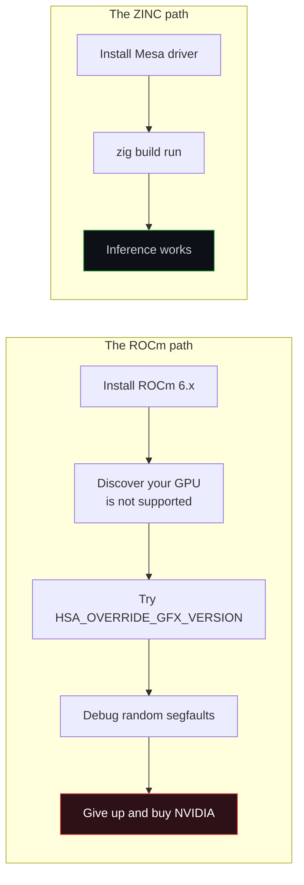
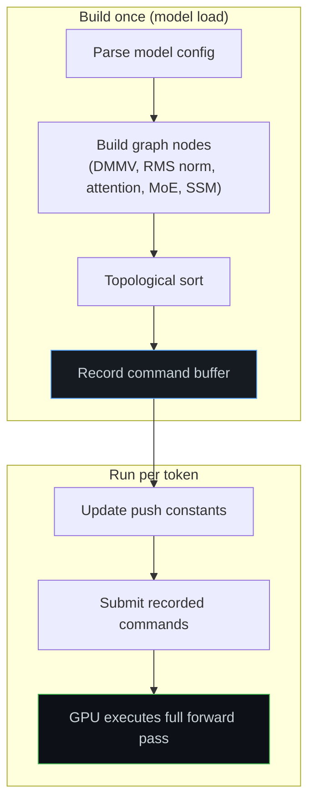
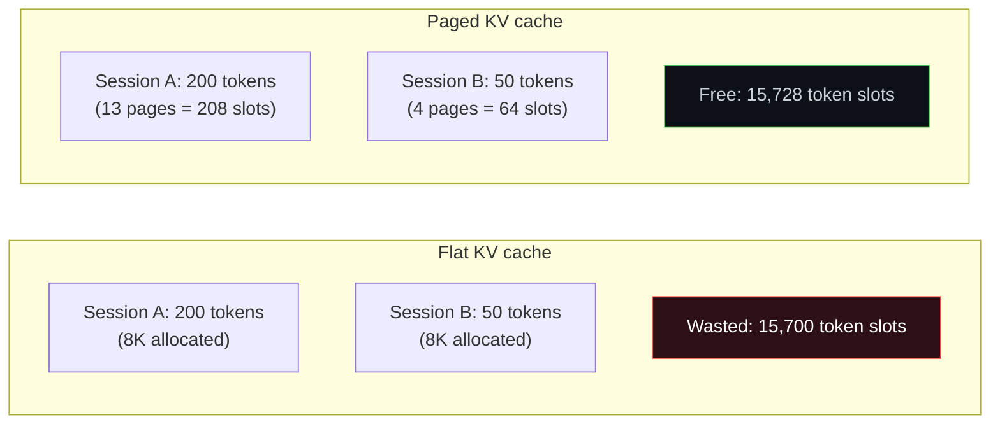
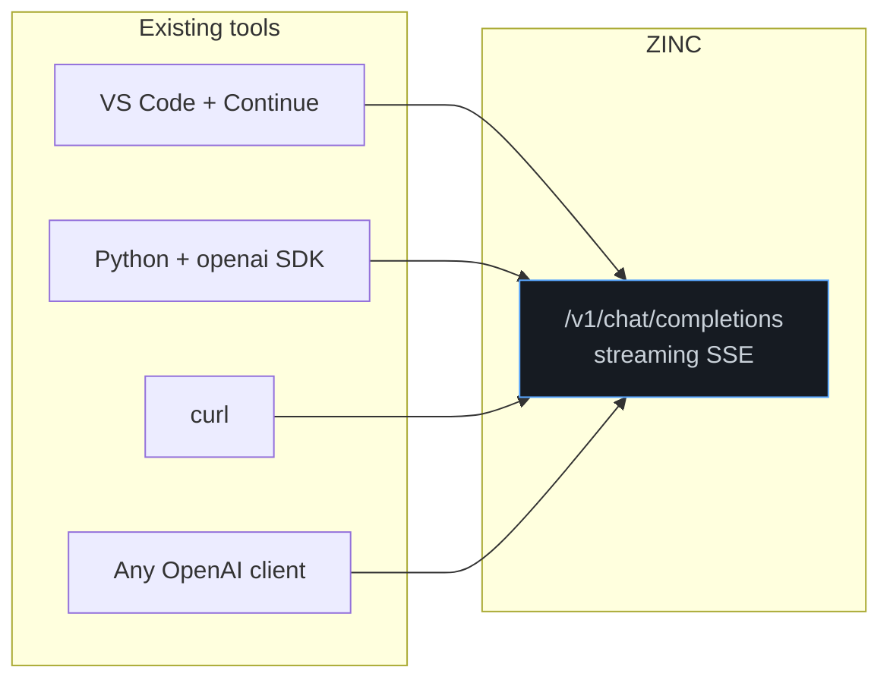
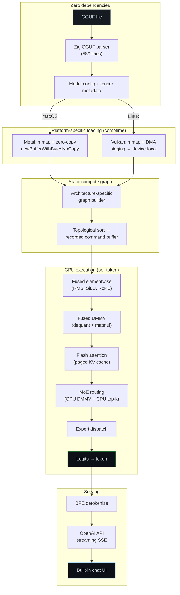

There is a meme format where step one is "draw two circles" and step two is "draw the rest of the owl." Building an inference engine from scratch follows the same pattern, except step one is "parse a GGUF file" and step two is "implement the entire forward pass of a 35-billion-parameter model on two different GPU architectures."

<figure class="diagram-card diagram-wide diagram-dual">
  
  <pre class="diagram-mobile-alt" role="img" aria-label="A two-step text version of the draw-the-owl inference engine diagram.">STEP 1
+----------------------+
| Parse GGUF header    |
+----------------------+
magic:   GGUF
version: 3
tensors: 562

STEP 2
+----------------------+
| Build the rest       |
+----------------------+
tokenizer -> embedding
layers -> attn / MoE / SSM
KV cache -> server -> chat UI</pre>
  <figcaption>Every inference engine project starts the same way. The interesting part is what happens after you can read the model file.</figcaption>
</figure>

ZINC started as a question: what would a local LLM inference engine look like if it was designed around the GPUs people actually own, instead of being retrofitted to run on them? That question led to a year of design decisions — some obvious, some painful, and a few that surprised us.

This post walks through every major choice in the ZINC architecture, why we made it, and what we learned. It is the blog post I wish I had read before starting.

## Decision 1: build from scratch instead of forking

The most common question we get is "why not fork llama.cpp?"

It is a fair question. [llama.cpp](https://github.com/ggml-org/llama.cpp) is battle-tested, covers dozens of models, and already has a Vulkan backend. Forking it and tuning the shaders for RDNA4 would have saved months. We considered it seriously.

We decided against it for one reason: llama.cpp's architecture optimizes for breadth, and ZINC needs to optimize for depth.

llama.cpp supports CUDA, Vulkan, Metal, OpenCL, SYCL, and CPU backends through a tensor-graph abstraction layer ([ggml](https://github.com/ggml-org/ggml)). That abstraction is the right design for a project that needs to run *everywhere*. But it also means every kernel is written to the lowest common denominator of what the abstraction exposes. You cannot write a RDNA4-specific shader that exploits wave64 dispatch, 32 KB of L0 vector cache per CU, and the exact memory coalescing rules of the gfx1201 ISA — because the abstraction does not know those things exist.

<figure class="diagram-card diagram-wide diagram-dual">
  
  <pre class="diagram-mobile-alt" role="img" aria-label="A text comparison between forking llama.cpp and building ZINC from scratch.">REJECT
[ fork llama.cpp ]
- quick start
- familiar code
- abstraction still sets the ceiling

APPROVE
[ build ZINC from scratch ]
- parser + kernels + KV cache
- Metal + Vulkan on native terms
- more work, more control</pre>
  <figcaption>The decision that turned a weekend project into something much larger.</figcaption>
</figure>

The bet was that a purpose-built engine, free to make platform-specific choices at every layer, would outperform a tuned fork on the hardware we care about. That bet has held up. ZINC's DMMV shaders achieve **93% memory bandwidth utilization** on large matmuls on RDNA4. That number comes from knowing exactly how the hardware works and writing shaders that cooperate with it, not through it.

The cost was real: we wrote a GGUF parser, a BPE tokenizer, a model config extractor, a paged KV cache, flash attention, 24 Vulkan shaders, 31 Metal shaders, an HTTP server, and a chat UI — all from scratch. But every one of those components is a clean seam we control, and that control has paid for itself every time we needed to do something the abstraction layer would have blocked.

## Decision 2: Zig, not C++, not Rust

The language choice deserves its own post (and [it got one](/blog/2026-04-02-why-zig-is-the-secret-weapon-behind-zinc)). The short version: Zig gives us C-level performance, first-class C interop for talking to Vulkan and Metal, comptime for zero-cost backend selection, explicit allocators for predictable memory, and a build system that compiles shaders without CMake.

But the deeper reason is cultural. Zig's design philosophy is "no hidden control flow, no hidden allocations, no hidden anything." In GPU programming, hidden things kill you. A silent allocation in a hot path. An exception that unwinds through a command buffer recording. A default constructor that secretly initializes a 4 GB buffer. Zig makes all of that structurally impossible.

```zig
// This is the entire GPU backend abstraction. Six lines.
const builtin = @import("builtin");

pub const is_metal = builtin.os.tag == .macos;
pub const is_vulkan = builtin.os.tag == .linux;

pub const backend = if (is_metal)
    @import("../metal/device.zig")
else
    @import("../vulkan/instance.zig");
```

When you compile on macOS, the Vulkan code does not exist. When you compile on Linux, Metal does not exist. No `#ifdef`. No runtime dispatch. No vtable. The compiler eliminates the dead path entirely. We got a cross-platform inference engine with the codegen of a single-platform one.

Rust was the other serious contender. We chose Zig over Rust because Zig's C FFI is frictionless (critical for Vulkan and Metal interop), the borrow checker would have fought us constantly on GPU buffer lifetimes that do not fit Rust's ownership model, and `build.zig` is dramatically simpler than `build.rs` + CMake + bindgen for a project that compiles both GLSL and Objective-C.

## Decision 3: Vulkan and Metal, not ROCm, not OpenCL

This is the decision that defines the project.

AMD's official compute stack for AI is [ROCm](https://rocm.docs.amd.com/). It supports HIP (a CUDA-like API), a mature compiler toolchain, and broad library support. But ROCm does not support consumer RDNA3 and RDNA4 GPUs as first-class targets. The cards people actually buy — RX 7900 XTX, RX 9070 XT, Radeon AI PRO R9700 — are second-class citizens in the ROCm ecosystem.

Vulkan, on the other hand, works on every AMD GPU with a driver. The [RADV](https://docs.mesa3d.org/drivers/radv.html) Mesa driver is open-source, actively maintained, and exposes compute shader features that map directly to what inference needs: large workgroups, shared memory, subgroup operations, and (on RDNA4) cooperative matrix.



The same logic applied to Apple Silicon. Apple has no CUDA. Apple has no ROCm. Apple has Metal. And Metal on Apple Silicon is *excellent* — unified memory means zero-copy model loading, simdgroup operations map cleanly to inference workloads, and the M-series chips have absurd memory bandwidth for their power envelope. Ignoring Metal would mean ignoring a massive installed base of capable hardware.

OpenCL was never seriously considered. It is too thin, too poorly maintained on modern hardware, and lacks the features (subgroup operations, cooperative matrix, explicit memory management) that make high-performance inference possible.

## Decision 4: static compute graphs

Every forward pass of a decoder-only transformer follows the same structure: for each layer, do attention (or SSM), then do FFN, then add a residual. The shapes are fixed. The operation order is fixed. The only thing that changes per token is the data.

ZINC exploits this by building a **static compute graph** once per model and replaying it for every token. The graph is a topologically sorted list of operations, each annotated with its shader pipeline, workgroup dimensions, push constants, and dependencies.



The alternative — the approach most frameworks take — is to build the graph dynamically each forward pass. That is more flexible (you can change the graph structure at runtime), but it pays a CPU cost every single token: allocating nodes, resolving dependencies, recording commands. On Vulkan, that CPU cost adds up. Each `vkCmdDispatch` is cheap (~0.016 µs), but the overhead of *deciding what to dispatch* is not.

With a static graph, the CPU work per token is essentially: update a few push constants, submit a pre-recorded command buffer, wait. The GPU does the rest.

The tradeoff is flexibility. Dynamic batching (processing different-length sequences simultaneously) is harder with a static graph. We accept that tradeoff for single-stream decode and plan to handle batching as a separate execution mode when that becomes the priority.

## Decision 5: one shader per quantization format

ZINC has six separate DMMV (dequantize-matrix-multiply-vector) shaders: one each for Q4_K, Q5_K, Q6_K, Q8_0, F16, and F32. Each is hand-tuned for its specific quantization layout. The Q4_K shader alone is over 7,000 lines of commented GLSL.

The alternative would be a two-stage approach: a generic dequantization pass that unpacks any format to F16/F32, followed by a generic matmul. We tried that. It was slower.

<figure class="diagram-card diagram-wide diagram-dual">
  
  <pre class="diagram-mobile-alt" role="img" aria-label="A text comparison between staged dequantization and fused dequantization.">STAGED
weights -> tmp -> matmul
VRAM: read -> write -> read
cost: 2x hot-path traffic

FUSED
weights -> dequant+dot -> out
VRAM: read -> write out
cost: no intermediate buffer</pre>
  <figcaption>The intermediate buffer is the enemy. Eliminating it is the single most impactful optimization in the DMMV path.</figcaption>
</figure>

The reason is bandwidth. Single-token decode is almost entirely memory-bandwidth bound. The GPU spends most of its time waiting for weight data to arrive from VRAM. If you dequantize to an intermediate buffer and then read that buffer again for the multiply, you double the memory traffic on the critical path.

A fused shader reads the quantized weights once, dequantizes them into registers, and accumulates the dot product immediately. No intermediate buffer. No extra memory traffic. The Q4_K shader knows exactly how the 12-byte super-block is packed — where the 6-bit scales live, where the 4-bit quants live, how to extract them with bit shifts — and it fuses that knowledge directly into the accumulation loop.

```glsl
// Q4_K fused dequant + dot product — no intermediate buffer
uint32_t qs_val = data_a_packed[qs_base + j];
float d0 = float(qs_val & 0xF) - 8.0;
float d1 = float((qs_val >> 4) & 0xF) - 8.0;
sum += (d0 * sc0 + min0) * s_x[x_idx]
     + (d1 * sc1 + min1) * s_x[x_idx + 1];
```

This is the kind of optimization that an abstraction layer makes very difficult. A generic matmul kernel cannot know the memory layout of Q4_K blocks. A fused shader can.

## Decision 6: shared memory for the input vector

This is subtle but it matters a lot.

In a DMMV operation, every output row reads the same input vector. If 64 threads each independently read the input vector from L1 cache, they compete for cache lines with the weight data reads — and the weight data is the much larger working set.

ZINC's DMMV shaders cooperatively load the input vector into **shared memory** (LDS on AMD, threadgroup memory on Metal) at the start of each block. All 64 threads then read from shared memory instead of L1. This keeps L1 cache free for weight data, where it matters most.

```glsl
// Cooperative load of input vector into shared memory
for (uint i = tid; i < K; i += 64) {
    s_x[i] = x_data[i];
}
barrier();  // All threads see the loaded data

// Now each thread reads weights from VRAM (through L1)
// and input from shared memory (no L1 contention)
```

On the RDNA4 AI PRO R9700, this pattern is the difference between **~80%** and **93%** bandwidth utilization on the vocabulary projection (248,320 x 2,048). That 13% gap represents about 75 GB/s of recovered bandwidth.

## Decision 7: paged KV cache from day one

Most inference engines start with a flat KV cache — a contiguous buffer sized for the maximum sequence length. It is simple and fast. It also wastes enormous amounts of VRAM when you have multiple sessions with different context lengths.

ZINC uses a **paged KV cache** inspired by [vLLM's PagedAttention](https://arxiv.org/abs/2309.06180). The cache is divided into 16-token pages, allocated on demand, and accessed through a page table.



We could have started with a flat cache and added paging later. We did not, because the page table lookup is trivial in the flash attention shader and costs almost nothing:

```glsl
uint page_idx = seq_pos / page_size;
uint page_off = seq_pos % page_size;
uint physical_addr = page_table[page_idx] * page_size + page_off;
```

That is two integer operations per attention score. On a 2,048-token sequence, the page table overhead is invisible in the profiler. But the memory savings are immediate: a 16 GB card can serve multiple concurrent sessions without running out of KV cache space.

The real payoff comes later, when continuous batching arrives. Paged allocation is a prerequisite for efficiently scheduling multiple requests with different context lengths onto the same GPU. By building it in from the start, we avoid the painful retrofit that most engines go through when they add batching support.

## Decision 8: fused elementwise kernels

There are about a dozen small operations in a transformer layer that are not matmuls: RMS normalization, SiLU activation, RoPE rotary embedding, residual addition, sigmoid gating, softmax. Each one is fast. Each one also reads and writes a full hidden-state vector from VRAM.

If you run them as separate kernels, you pay memory bandwidth for every intermediate result:

```
RMS norm:  read x → write norm_x     (bandwidth: 2 × hidden_dim × 4 bytes)
Scale:     read norm_x → write scaled (bandwidth: 2 × hidden_dim × 4 bytes)
SiLU:      read gate → write silu     (bandwidth: 2 × hidden_dim × 4 bytes)
Multiply:  read silu, up → write out  (bandwidth: 3 × hidden_dim × 4 bytes)
```

That is **nine** VRAM round trips for work that is computationally almost free. ZINC fuses these into compound kernels:

| Fused kernel | Operations | VRAM reads | VRAM writes |
|---|---|---|---|
| `rms_norm_mul` | RMS norm + element-wise scale | 2 | 1 |
| `swiglu` | SiLU(gate) × up | 2 | 1 |
| `rope_fused` | RoPE rotate + reshape + KV cache write | 1 | 2 |
| `sigmoid_mul` | sigmoid(x) × y (attention gating) | 2 | 1 |

Each fusion cuts the intermediate traffic in half or better. Across 40 layers, the fused kernels save roughly **3 ms per token** compared to the unfused version. On a 26 ms decode cycle, that is an 11% throughput improvement from eliminating memory traffic, not from doing less math.

## Decision 9: native GGUF parser, native tokenizer, native everything

ZINC has **zero external runtime dependencies** beyond the system GPU driver. The GGUF parser is 589 lines of Zig. The BPE tokenizer reads vocabulary and merge rules directly from GGUF metadata. The HTTP server is a minimal implementation in `std.net`. The chat UI is a single HTML file embedded in the binary.

<figure class="diagram-card diagram-wide diagram-dual">
  
  <pre class="diagram-mobile-alt" role="img" aria-label="A four-step text version of the dependency galaxy brain diagram.">PANEL 1  import PyTorch + transformers
PANEL 2  link llama.cpp + GGUF loader
PANEL 3  write the GGUF parser in Zig
PANEL 4  embed the chat UI in the binary

direction:
more ownership -> fewer dependencies</pre>
  <figcaption>The dependency count of ZINC is the same as the number of external libraries it links: zero (not counting the GPU driver).</figcaption>
</figure>

This was not minimalism for its own sake. It was a pragmatic choice driven by three concerns:

**Reproducibility.** When a user reports a bug, we need to know exactly what code is running. If the tokenizer is a Python library, the GGUF loader is a C library, and the HTTP server is a Go binary, the debugging surface is enormous. When everything is in one language and one binary, `git bisect` works on the entire stack.

**Startup time.** ZINC starts in under a second, including model memory-mapping. There is no interpreter, no JIT, no dynamic library resolution chain. The binary runs directly.

**Deployment.** A single static binary with no dependencies is trivially deployable. `scp` it to any machine with a GPU driver and it works. No conda environments, no Docker images, no version conflicts.

The GGUF parser is a good example of why "just use a library" is not always the right call. GGUF is a simple format: a header, metadata key-value pairs, and tensor descriptors pointing to offsets in the file. Parsing it is a few hundred lines of sequential reads. Writing our own means we can handle errors exactly the way we want, memory-map exactly the regions we need, and avoid pulling in a C library that brings its own allocator, its own error handling, and its own assumptions about what happens after parsing.

## Decision 10: OpenAI-compatible API, not just a CLI

An inference engine that only works as a CLI tool is a demo. An inference engine that exposes an API is infrastructure.

ZINC exposes `/v1/chat/completions`, `/v1/completions`, and `/v1/models` — the same endpoints that OpenAI's API uses. Any client that speaks the OpenAI protocol (which is most of them at this point) can point at ZINC and get local inference without code changes.



The server supports streaming via Server-Sent Events, stop sequence detection, chat template formatting (Qwen, Llama, Mistral, etc.), and session reuse with an LRU cache. It also serves a built-in chat UI at the root path, because sometimes you just want to type into a browser without setting up a client.

This decision shaped the project more than we expected. Once you commit to serving an API, you start thinking about concurrent requests, session lifetimes, memory budgets, and graceful degradation — concerns that never arise in a CLI tool. Those concerns pushed us toward paged KV cache, toward clean session management, and toward the kind of operational awareness that separates a demo from something you can actually leave running.

## Decision 11: MoE routing on CPU

This one is counterintuitive. Everything else in the forward pass runs on the GPU. Why does MoE expert selection happen on the CPU?

The answer is that routing is the *wrong bottleneck to eliminate*.

MoE routing involves three steps: multiply the hidden state by the router weight matrix (a DMMV), apply softmax to the router logits, and select the top-k experts. The DMMV is bandwidth-bound and belongs on the GPU. The softmax + top-k operates on a tiny vector (256 elements for Qwen3.5's 64 routed experts) and takes microseconds on the CPU.

The awkward part is the GPU-to-CPU readback of the router logits. That readback requires a Vulkan fence wait. It synchronizes the CPU and GPU timelines. It feels expensive in principle.

In practice, it costs about **0.3 ms** per layer, and the alternative — implementing top-k selection as a GPU shader with atomic operations or multi-pass reduction — would be more complex, more fragile, and would save less time than you think, because the CPU is otherwise idle during GPU execution anyway.

We did eventually write a [GPU-side softmax+top-k shader](/blog/2026-03-29-the-shaders-standing-between-4-tok-s-and-27-tok-s) to reduce the total number of synchronization points. But the expert selection itself remains CPU-side, because it is simpler, debuggable, and fast enough.

This is a recurring theme in ZINC's design: do the simple thing that works, measure whether it matters, and only optimize when the profiler says so. The profiler has never said "top-k selection is your bottleneck."

## Decision 12: architecture-specific graph builders

ZINC does not have one graph builder. It has three: one for standard transformers (Llama), one for MoE hybrids (Qwen3.5-35B-A3B), and one for SSM/attention hybrids (Mamba-style).

```zig
pub fn buildDecodeGraph(config: ModelConfig) Graph {
    return switch (config.architecture) {
        .llama, .mistral => buildLlamaDecodeGraph(config),
        .qwen_moe => buildMoeDecodeGraph(config),
        .mamba, .jamba => buildMambaDecodeGraph(config),
    };
}
```

This could have been a single generic builder with conditionals for each layer type. We tried that. It became an unreadable mess of `if (layer.is_attention and not layer.is_moe and not layer.has_ssm_conv)` checks nested three levels deep.

Separate builders are more code but much clearer code. Each one reads like a description of the architecture it implements:

```zig
// MoE decode graph: every 4th layer is attention, others are SSM, all have MoE FFN
fn buildMoeDecodeGraph(config: ModelConfig) Graph {
    var graph = Graph.init();
    for (0..config.n_layers) |layer| {
        graph.addNode(.rms_norm_mul, ...);
        if (layer % 4 == 0) {
            // Full attention path
            graph.addNode(.dmmv, ...);  // QKV projection
            graph.addNode(.rope_fused, ...);
            graph.addNode(.flash_attn, ...);
            graph.addNode(.dmmv, ...);  // output projection
        } else {
            // SSM path
            graph.addNode(.ssm_conv1d, ...);
            graph.addNode(.ssm_delta_net, ...);
        }
        // MoE FFN (all layers)
        graph.addNode(.dmmv, ...);      // router
        graph.addNode(.softmax_topk, ...);
        // ... expert dispatch
    }
    return graph;
}
```

When we need to support a new architecture, we write a new builder. It takes about an hour if the architecture is a standard variation, because the building blocks (DMMV nodes, attention nodes, SSM nodes) are reusable. The graph builder is the place where architectural knowledge lives, and keeping that knowledge explicit has prevented entire categories of "wrong layer type" bugs.

## The architecture, all together

Here is what the full stack looks like when all of these decisions combine:



Every box in that diagram is code we wrote, in one language, compiled into one binary. There is no glue layer. There is no "call out to Python for tokenization." There is no "shell out to another process for the API." The whole thing is a single Zig program that you compile and run.

## What we got wrong (and fixed)

Not every decision was right the first time.

**We underestimated SSM debugging cost.** The delta-net state space layers in Qwen3.5-35B carry persistent recurrent state across tokens. A tiny numerical error in token 1 compounds through every subsequent token. We spent more time debugging SSM shaders than every other shader combined. If we started over, we would build per-tensor comparison tooling against a reference implementation before writing the first SSM shader, not after.

**We started with CPU fallbacks for everything.** The first working forward pass ran MoE routing, SSM conv1d, SSM state updates, and gated normalization on the CPU. That made debugging easier but hid the real performance profile. When we finally moved those operations to GPU shaders, the [synchronization overhead alone](/blog/2026-03-29-the-shaders-standing-between-4-tok-s-and-27-tok-s) was eating 45 ms per token. We should have measured the CPU-GPU sync cost earlier and set a harder deadline for writing the GPU versions.

**We over-specified shader workgroup sizes.** Early shaders hardcoded workgroup sizes for specific tensor dimensions. When we tested on a different model with different hidden dimensions, half the shaders dispatched wrong. We now use push constants for all dimension-dependent values and only hardcode the wave size (64 on RDNA, which is a hardware constant, not a model parameter).

<figure class="diagram-card diagram-wide diagram-dual">
  
  <pre class="diagram-mobile-alt" role="img" aria-label="A text version of the this is fine debugging diagram.">[pass] tokenizer OK
[warn] descriptor mismatch
[note] stabilize tensors first

fires:
- SSM state NaN
- delta-net drift
- MoE router logits = 0
- flash attention softmax = -inf

"this is fine"</pre>
  <figcaption>The forward pass worked on the first try. The output was just garbage for the next two weeks.</figcaption>
</figure>

## What we would do exactly the same

**Zig.** The language paid for itself within the first week. Comptime, explicit allocators, C FFI, and the build system are not nice-to-haves. They are structural advantages that made the dual-backend architecture possible.

**From scratch.** Every month of extra work building our own components has been repaid by the ability to optimize without asking permission from an abstraction layer.

**Vulkan + Metal directly.** No middleware, no compatibility layers, no "works on everything but fast on nothing." Two backends, each tuned for its hardware, selected at compile time.

**Paged KV cache from day one.** It cost almost nothing to implement and will save a painful retrofit when batching arrives.

**Fused shaders.** One shader per quantization format, with dequantization fused into the dot product. The bandwidth savings are too large to leave on the table.

**The OpenAI API.** Making ZINC a drop-in replacement for existing clients was the single best product decision we made. It turns a systems project into something people can actually use.

## Where this is going

The architecture is designed to support what comes next without major rewrites:

- **Continuous batching**: the paged KV cache and static graph structure are ready. The main work is a batch-aware dispatch layer.
- **TurboQuant KV compression**: 3-bit quantized KV cache, cutting memory by ~5x. The paged cache makes this a per-page transformation.
- **Speculative decoding**: draft models on the same GPU, verified against the main model. The static graph makes this composable.
- **Multi-GPU**: split layers across devices. The graph builder already annotates per-layer costs for scheduling.

None of these require rethinking the core architecture. That is the real test of whether design decisions were good: not whether they work today, but whether they leave room for tomorrow.

If you want to run ZINC, [Getting Started](/zinc/docs/getting-started) gets you going in five minutes. The full source is at [github.com/zolotukhin/zinc](https://github.com/zolotukhin/zinc). And if you want the story from the beginning: [why we are building ZINC](/blog/2026-03-25-why-we-are-building-zinc), [the first bugs](/blog/2026-03-27-what-broke-first-when-we-built-zinc-on-amd-rdna4), [the shader debugging](/blog/2026-03-29-the-shaders-standing-between-4-tok-s-and-27-tok-s), [the performance journey](/blog/2026-03-30-how-we-moved-zinc-from-7-tok-s-to-33-tok-s-on-amd-rdna4), [the Metal port](/blog/2026-04-01-bringing-zinc-to-apple-silicon), and [why Zig](/blog/2026-04-02-why-zig-is-the-secret-weapon-behind-zinc).

Every decision in this post was a bet that focus beats generality. So far, the bets are paying off.
