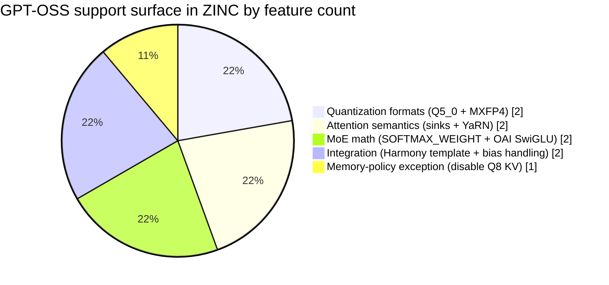

The easiest way to misunderstand GPT-OSS 20B is to look only at the file size.

On disk, the managed GGUF we ship in ZINC is about **11.67 GB**. In the catalog it is marked as a **14 GB** fit target, and on Apple Silicon we describe it as a **16+ GB unified-memory** model. If you stop there, it looks like a pleasant middleweight: smaller than our Qwen3.5-35B-A3B target, comfortably local, probably just another "load the GGUF and run the same kernels" exercise.

That was the wrong mental model.

What GPT-OSS 20B actually did was expose every shortcut we could no longer take. It brought in quantization formats our Vulkan path did not support, model-specific Mixture of Experts math, attention sinks, YaRN-scaled RoPE, Harmony-style chat formatting, and a memory-quality problem severe enough that we had to disable one of our normal Metal KV optimizations just for this model family. By the time it worked cleanly, GPT-OSS had become less of a new model entry and more of a forcing function for the Metal backend.

This post is the technical story of that bring-up. If you want the broader engine context first, read [Bringing ZINC to Apple Silicon](/blog/2026-04-01-bringing-zinc-to-apple-silicon), [How Mixture of Experts models work in ZINC](/blog/2026-04-04-how-moe-models-work-in-zinc), and [Every design decision behind ZINC](/blog/2026-04-03-every-design-decision-behind-zinc).

## Why this mattered now

OpenAI describes [`gpt-oss-20b`](https://platform.openai.com/docs/models/gpt-oss-20b) as its medium-sized open-weight model for low-latency, local, and specialized deployments. In the [launch post](https://openai.com/index/introducing-gpt-oss/), OpenAI says the model has **21B total parameters**, **3.6B active parameters per token**, **24 layers**, **32 experts**, **4 active experts per token**, and a **128k native context window**.

That combination is exactly why it is interesting for ZINC.

It is not a toy model. It is not a dense transformer with one obvious hot path. It is a real open-weight reasoning model that is small enough to care about on consumer and prosumer machines, but different enough from Qwen and Gemma that "works on our existing MoE path" was never a serious assumption.

On paper, GPT-OSS 20B is also a near-perfect Apple Silicon problem:

| Property | Why it matters in ZINC |
| --- | --- |
| 11.67 GB GGUF | Small enough to fit on a 16 GB or 32 GB unified-memory Mac without turning the machine into a science experiment |
| 14 GB catalog budget | Tight enough that memory policy matters immediately |
| 128k native context | Much larger than what we are willing to reserve by default today |
| 32 experts / 4 active | Sparse enough to care about routing details |
| OpenAI Harmony format | Forces tokenizer and chat-template correctness, not just kernel correctness |

The key tension is in the third row. OpenAI says 128k context. ZINC does **not** try to reserve 128k context for this model on Metal today. The managed catalog keeps GPT-OSS 20B at a **4096-token default context** because our current goal is "tested + exact fit" on Apple Silicon, not "advertise the largest number the model card contains and let the runtime drown later."

That decision is not marketing. It is engine policy.

## GPT-OSS was not "just another MoE model"

Before GPT-OSS, ZINC already knew how to run:

- dense transformer families
- Qwen3.5 hybrid MoE
- Gemma MoE
- Vulkan and Metal backends
- GGUF chat templates across several families

So what was left?

Quite a lot.

<figure class="diagram-card diagram-wide">


  <figcaption>GPT-OSS support cut across tokenizer, loader, kernel coverage, attention math, and MoE math. No single fix unlocked the model by itself.</figcaption>
</figure>

The shortest honest description is this: GPT-OSS speaks a different dialect than the models we had already optimized around.

Here is what changed at the runtime level:

| Area | Qwen / Gemma baseline | GPT-OSS requirement |
| --- | --- | --- |
| Quantized DMMV formats | Mostly `q4_k`, `q5_k`, `q6_k`, `q8_0` | Adds `q5_0` and `mxfp4` in hot paths |
| Chat template | ChatML, Gemma turns, Llama-style headers | Harmony-style `<|start|>role<|message|>...` transport |
| Router selection | Standard softmax then top-k | `SOFTMAX_WEIGHT`: top-k on raw logits, then softmax only selected experts |
| Expert activation | Standard SwiGLU / GEGLU | OpenAI-specific clipped SwiGLU variant |
| Attention | Standard RoPE + flash attention | Attention sinks, YaRN scaling, extra biases |
| KV policy | Q8 KV is often a good trade | GPT-OSS needed **Q8 KV disabled** by default on Metal |

That last row is the detail that makes this model interesting even if you only care about systems work. Normally, reducing KV bandwidth is one of the first things you try on Apple Silicon. For GPT-OSS we went the other direction. The current Metal runtime explicitly disables Q8 KV for `gpt_oss` because the model's OAI SwiGLU path was sensitive enough to KV quantization noise that output quality degraded into degenerate generations.

The lesson was simple: "more compressed" is not the same thing as "better deployed."

## Why Metal got there before Vulkan

The funniest part of this whole bring-up is that Metal was the friendlier backend.

That sounds backwards. Vulkan is the original ZINC path. Metal came later. But GPT-OSS landed right in the middle of a gap between the two backends:

- the Vulkan DMMV dispatcher still only covered `q4_k`, `q5_k`, `q6_k`, `q8_0`, `f16`, and `f32`
- the Metal runtime already had room for model-family special cases and runtime-compiled shader iteration
- Apple Silicon's unified-memory model made exact-fit experimentation cheaper

On AMD, our early GPT-OSS experiment failed in the first attention projection because Vulkan had no `q5_0` pipeline. On Metal, the problem was not "this quant type does not exist." The problem was "this model has enough special cases that we need to teach the backend its language."

That turned out to be the better problem to have.

## The memory story: exact fit beats theoretical context

Apple's Metal documentation leans hard on the fact that Apple GPUs use a [unified memory model](https://developer.apple.com/documentation/metal/choosing-a-resource-storage-mode-for-apple-gpus). CPU and GPU can both see shared memory, and that changes what "loading a model" should mean.

For GPT-OSS 20B, that mattered immediately.

The managed catalog entry in ZINC looks like this in practical terms:

| Metric | Value |
| --- | ---: |
| GGUF file size | 11,673,418,816 bytes |
| Managed VRAM budget | 14 GiB |
| Published recommendation in docs | 16+ GB unified memory |
| Default context in catalog | 4096 tokens |
| Tested profile | Apple Silicon |

On Vulkan, a model like this wants staging buffers, DMA, and a very clear device-local budget. On Metal, ZINC can wrap page-aligned `mmap` regions as `MTLBuffer`s and let the GPU read the same physical pages directly. That is exactly the kind of zero-copy path Apple Silicon deserves, and exactly why we did not want a fake Vulkan-shaped Metal implementation.

But unified memory does **not** mean infinite memory.

GPT-OSS arrives with a 128k native context and a model card that invites ambitious deployments. If we had mirrored that number into the managed catalog, the user-facing experience would have been worse, not better. The right move was to keep the default runtime envelope small, exact, and tested, then expand context dynamically as the memory planner improves.

That is the more interesting engineering decision anyway. "Fit first, expand later" is how you keep a local engine honest.

## The two quantization formats that changed the shape of the backend

The most visible GPT-OSS-specific work on Metal was quant coverage.

### `q5_0`: the annoying 22-byte block that broke alignment assumptions

The `q5_0` format looks innocent until you implement it in a GPU kernel.

Each block stores **32 values in 22 bytes**:

- 2 bytes of fp16 scale
- 4 bytes of `qh` high-bit data
- 16 bytes of packed 4-bit values

The nasty part is that the `qh` word starts **2 bytes** into the block. Once you add a nonzero byte offset into a larger weight buffer, a naive `uint32` load can become unaligned. That is exactly the kind of bug that passes simple happy-path tests and then silently returns nonsense on real hardware.

We hit that class of failure on Apple Silicon, and the fix was not glamorous. The Metal kernel stopped assuming it could reinterpret the data as an aligned `uint32` and started reading the `qh` bytes explicitly. There are now dedicated regression tests for the exact failure mode:

- one focused test for nonzero-offset `q5_0` reads
- one stress test across many rows and alignment patterns

That bug is worth calling out because it is a perfect example of what "supporting a new quantization" actually means. It is not adding an enum case. It is proving that your packed-bit interpretation survives the ugly offsets a real loader produces.

### `MXFP4`: because GPT-OSS experts do not live in the usual quant world

GPT-OSS also brought **MXFP4** into the backend. ZINC's Metal path now includes a dedicated `dmmv_mxfp4` kernel plus CPU reference dequantization for validation.

That matters for two reasons:

1. MXFP4 is not one more `ggml`-style K-quant that can piggyback on existing decode assumptions.
2. MoE models amplify unsupported formats because one unsupported expert tensor can invalidate an entire fast path.

In practice, adding MXFP4 meant:

- loader and GGUF-format awareness
- CPU reference dequantization
- a Metal DMMV implementation
- correctness tests that compare shader output to CPU reference

It is one of those features that looks niche until the first model you care about depends on it.

## GPT-OSS changed the MoE math too

Quantization was only half the story. GPT-OSS also diverged at the MoE layer itself.

### Router selection: `SOFTMAX_WEIGHT`, not the usual top-k

Many MoE implementations do:

1. softmax over all expert logits
2. top-k selection on probabilities
3. renormalize selected experts

GPT-OSS uses a different rule in ZINC's implementation:

1. select top-k from **raw logits**
2. softmax only the selected logits
3. normalize that selected set

That sounds like a small semantic difference. It is not. Routing is one of the highest-leverage places in an MoE model. Get it wrong and the system still produces text, but it is the wrong model.

### Expert activation: OAI SwiGLU is close to SwiGLU, but not the same

The OpenAI-specific expert activation is another example of "close enough" being wrong. In ZINC's CPU reference, the GPT-OSS expert path computes:

```zig
const alpha: f32 = 1.702;
const limit: f32 = 7.0;
const x = @min(gate[i], limit);
const y = std.math.clamp(up[i], -limit, limit);
const glu = x / (1.0 + @exp(alpha * (-x)));
output[i] = glu * (y + 1.0);
```

That is not the same as the plain SwiGLU path we use elsewhere. GPT-OSS also brings in router bias, Q/K/V bias, O-projection bias, and per-expert down-bias handling on the Metal side.

This is what I mean by GPT-OSS being a forcing function. It is not just a model with different weights. It is a different numerical contract.

## Attention was more model-specific than we wanted

Transformer attention is one of those areas where people say "attention is attention" right up until a model proves otherwise.

GPT-OSS pushed three extra requirements into the Metal runtime:

- **attention sinks**
- **YaRN-scaled RoPE**
- **extra projection biases**

The Metal runtime now allocates a dedicated attention-sinks buffer, scans model tensors for `attn_sinks.weight`, and uploads per-layer sink values when present. The RoPE path always uses precomputed frequencies on Metal, which lets us fold in model-provided scaling cleanly. And for GPT-OSS specifically, the runtime applies the model's Q/K/V and O-projection biases where they exist.

That whole stack is easy to underestimate because the forward pass still looks like "project QKV, rotate, write KV, flash attention, project out." But the fidelity work is all in the details around that spine.

Here is the support surface that GPT-OSS added to the Metal backend, counted by model-specific feature bucket rather than by lines of code:



Caption: this is not a time estimate. It is a count of distinct model-specific feature classes the backend had to learn before GPT-OSS behaved like GPT-OSS instead of "some other MoE model wearing the right filename."

## The chat template mattered more than it should have

OpenAI's [Hugging Face model card](https://huggingface.co/openai/gpt-oss-20b) is very explicit that GPT-OSS expects the **Harmony** response format. If the prompt transport is wrong, the model is wrong before any shader runs.

That forced a tokenizer-level change in ZINC, not just a backend change.

The GPT-OSS template path in the tokenizer now emits:

- `<|start|>role<|message|>content<|end|>` for most messages
- `<|return|>` on assistant messages
- `<|start|>assistant` as the generation suffix, matching the model's expected continuation format

This is the part people skip in postmortems because it does not look like "real systems work." That is a mistake. Local inference engines fail just as hard on template mismatches as they do on invalid buffer offsets. One gives you the wrong tokens for semantic reasons. The other gives you the wrong tokens for numeric reasons. Users do not care which category the bug fits into.

## The proof: we tested the weird parts, not just the happy path

The strongest signal that GPT-OSS support in Metal is real is not that the model shows up in the catalog. It is that the backend has tests for the parts most likely to lie.

The focused Metal-side proof points include:

| Test surface | Why it exists |
| --- | --- |
| `dmmv_q5_0` with nonzero offset | Catches the unaligned `qh` read bug that broke Apple Silicon correctness |
| `dmmv_q5_0` across many rows | Stress-tests alignment patterns and packed-bit extraction |
| `dmmv_mxfp4` against CPU reference | Proves the MXFP4 lookup/dequant path matches host math |
| Flash attention contiguous-KV fast path | Keeps the Metal attention path grounded against CPU reference math |

And at the repo level, the full test suite is currently passing with:

- **206 passing tests**
- **2 skipped smoke tests**
- **0 failures**

That does not mean GPT-OSS support is "done forever." It means the current implementation is pinned to actual numeric checks instead of vibes.

## What the numbers say

There are two numbers in this story that matter more than the others.

The first is the model envelope:

| Case | Number | Why it matters |
| --- | ---: | --- |
| GGUF file size | 11.67 GB | Small enough to be practical on Apple Silicon |
| Managed VRAM requirement | 14 GiB | Tight enough that runtime memory policy matters |
| Docs recommendation | 16+ GB unified | Realistic deployment target for local Macs |
| Native context from OpenAI | 128k | What the model architecture supports |
| ZINC default catalog context | 4096 | What we currently choose to reserve safely |

The second is the support surface:

| What GPT-OSS forced us to add or handle explicitly | Count |
| --- | ---: |
| New quantized DMMV families on Metal (`q5_0`, `mxfp4`) | 2 |
| New attention/runtime semantics (sinks, YaRN, bias paths) | 3 |
| New MoE semantics (routing rule, activation rule) | 2 |
| New transport/template behavior | 1 |
| Model-specific memory-policy exception | 1 |

The first table tells you why GPT-OSS is a compelling local model.

The second tells you why adding it was not a catalog-edit-only change.

## The tradeoff

GPT-OSS 20B is running in ZINC on Metal because Metal was flexible enough to absorb the model's differences quickly. But that does **not** mean we solved every GPT-OSS problem.

What improved:

- the model is a first-class managed entry on Apple Silicon
- ZINC now has Metal coverage for `q5_0` and `mxfp4`
- the tokenizer understands the OpenAI MoE / Harmony-style prompt format
- the Metal runtime understands GPT-OSS-specific routing, activation, sinks, and RoPE scaling

What stayed hard:

- GPT-OSS still pushes against our current context-residency policy
- some GPT-OSS-specific expert handling still runs through CPU-side logic in the Metal path
- model quality was sensitive enough that one standard optimization, Q8 KV, had to be disabled for this family

What is still missing:

- Vulkan parity for the same model family
- larger dynamic context reservation on Metal without overcommitting unified memory
- more of the GPT-OSS-specific MoE math moved fully onto the GPU hot path

That last point is the honest bottom line. Supporting GPT-OSS on Metal was not the finish line. It was the point where the backend became sophisticated enough that the next bottlenecks are worth attacking.

## What comes next

The next stage is not "add another model." It is turning GPT-OSS support into a stricter systems advantage.

Three things matter from here:

1. make the GPT-OSS MoE path more GPU-native end to end
2. keep expanding memory planning so Apple Silicon can use more of the available unified-memory envelope without pretending it is discrete VRAM
3. bring the missing quantization coverage and runtime semantics over to Vulkan so GPT-OSS is not Metal-first forever

That is why GPT-OSS 20B was such a good model to bring up.

It forced us to stop thinking of model support as a loader problem. It is a tokenizer problem, a kernel problem, an attention problem, a memory-policy problem, and a validation problem all at once. If an inference engine survives that combination, it is probably becoming a real engine.

If you want to try the exact model we are talking about, the managed entry in ZINC points to [Bartowski's GGUF build](https://huggingface.co/bartowski/openai_gpt-oss-20b-GGUF). For the model-family context, OpenAI's [GPT-OSS launch post](https://openai.com/index/introducing-gpt-oss/) and the [`gpt-oss-20b` model page](https://platform.openai.com/docs/models/gpt-oss-20b) are the right external references. And if you want the backend side of the story from the beginning, start with [our Metal bring-up post](/blog/2026-04-01-bringing-zinc-to-apple-silicon).
