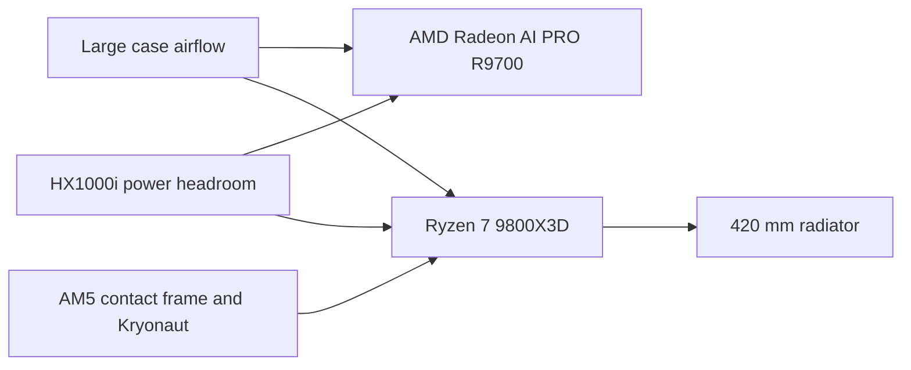
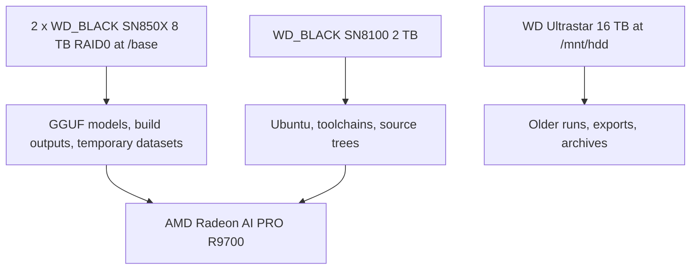

The machine that matters most to ZINC is not in a datacenter. It is a single tower at home, and right now it is the box that decides whether an optimization is real or just a good story. The current node is built around an AMD Radeon AI PRO R9700, a Ryzen 7 9800X3D, 96 GB of DDR5, an ASUS ProArt PA602 case, a ProArt LC 420 with Noctua radiator fans, and enough fast local storage that model copies and benchmark artifacts do not constantly get in the way.

That shape matters more than it may sound. ZINC is not a project where I can get away with vague claims about "good local AI performance." If I change a shader, a graph schedule, or a memory layout, I need a machine that can run the same workload over and over and tell me whether the change actually moved the number. A home setup for this kind of work has to be boring in the right places, fast where it counts, and easy to reason about when something regresses.

## The shape of the setup

The setup is deliberately split in two. I edit and iterate from my everyday machine, but the serious builds, validation runs, and throughput benchmarks land on the RDNA4 node over SSH. That keeps the development loop simple and makes the benchmark box behave like a small internal lab machine instead of a desktop that is always half-busy doing something else.

*Diagram: The home setup is a simple two-machine loop. Editing happens locally, but every serious result gets pushed onto the dedicated RDNA4 tower before I trust it.*

The important point here is not the network hop. It is the separation of concerns. The benchmark machine stays close to a known-good state, while the editing machine can stay messy. That makes it much easier to compare ZINC against llama.cpp, rerun the same prompt, and know that the result changed because the code changed.

## The physical build is simple on purpose

The chassis, cooling, and power choices are all aimed at the same goal: keep one large GPU and one fast AM5 CPU happy for long runs without turning the office into a wind tunnel. I am not trying to build a flashy showpiece here. I want a machine that is easy to cool, easy to service, and boring enough that thermals do not become a hidden variable in benchmark work.

These are the actual purchase links I have for the physical build pieces:

| Part | Current choice | Why it is there | Buy link |
| --- | --- | --- | --- |
| Case | ASUS ProArt PA602 | Big-airflow E-ATX case with room for a serious GPU, large fans, and a 420 mm radiator | [Amazon](https://www.amazon.com/dp/B0CPP3DWLX) |
| CPU cooler | ASUS ProArt LC 420 | Simple oversized cooling for a machine that spends a lot of time compiling and benchmarking | [Amazon](https://www.amazon.com/dp/B0CXLJ2N5B) |
| Radiator fans | 3 x Noctua NF-A14 industrialPPC-2000 PWM | High static pressure and predictable cooling on the radiator | [Amazon](https://www.amazon.com/dp/B00KESSUDW) |
| Additional case fans | Noctua NF-A20 PWM chromax.Black.swap and Noctua NF-A12x25 PWM chromax.Black.swap | Large low-noise airflow where possible, one excellent 120 mm fan where it helps most | [NF-A20](https://www.amazon.com/dp/B07ZP46RNR) and [NF-A12x25](https://www.amazon.com/dp/B09C6DQDNT) |
| CPU contact frame | Thermalright AM5 CPU Contact Frame V2 | Cheap mechanical insurance for repeatable mounting pressure and clean CPU contact | [Amazon](https://www.amazon.com/dp/B0D1V45DSL) |
| Thermal paste | Thermal Grizzly Kryonaut, 1 g kit | Good paste, plus wipes so remounting the cooler is not annoying | [Amazon](https://www.amazon.com/dp/B0F48FLCRX) |
| Power supply | Corsair HX1000i | Plenty of headroom for a single-GPU workstation without making the PSU the constraint | [Amazon](https://www.amazon.com/dp/B0BZ2CRW8H) |

*Diagram: The physical build is not complicated. The priorities are straightforward airflow, predictable CPU mounting, and enough PSU margin that long runs feel like normal workstation behavior, not a stress test.*

What matters is not the fan count by itself. What matters is that the case gives the GPU space, the CPU cooler has more than enough thermal capacity, and the machine does not have to solve its problems by getting louder. That is a much better fit for a home office than a cramped high-RPM build.

## The node I actually benchmark on

As of March 26, 2026, these are the compute and storage parts I can verify directly from the running machine with `hostnamectl`, `lscpu`, `dmidecode`, and `lsblk`. Where I have the exact purchase link, I used it. For the GPU, current US retail availability is still uneven, so I linked a current AI PRO R9700 board listing rather than pretending workstation GPU retail is tidy.

| Part | Current choice | Why it is in the build | Buy link |
| --- | --- | --- | --- |
| CPU | [AMD Ryzen 7 9800X3D](https://www.amazon.com/dp/B0DKFMSMYK) | Fast single-thread responsiveness, low platform drama, and more than enough CPU for orchestration, tokenization, and build work | [Amazon](https://www.amazon.com/dp/B0DKFMSMYK) |
| Motherboard | [ASRock X870E Taichi](https://www.amazon.com/dp/B0DFP2Q3TM) | Stable AM5 platform, strong I/O, and enough NVMe flexibility for a storage-heavy local inference box | [Amazon](https://www.amazon.com/dp/B0DFP2Q3TM) |
| GPU | AMD Radeon AI PRO R9700, 32 GB | This is the whole point of the node: 32 GB of VRAM, RDNA4, and enough memory bandwidth to make 35B-class local inference interesting | [Current retail example](https://www.newegg.com/asrock-creator-r9700-ct-radeon-ai-pro-r9700-32gb-graphics-card/p/N82E16814930143) |
| Memory | [G.SKILL Trident Z5 Neo RGB 96 GB DDR5-6000 CL26](https://www.amazon.com/dp/B0F79YGMX1) | Large model files, build artifacts, browser tabs, scripts, and benchmark tools can all coexist without the machine feeling cramped | [Amazon](https://www.amazon.com/dp/B0F79YGMX1) |
| OS drive | [WD_BLACK SN8100 2 TB](https://www.amazon.com/dp/B0F3BD1W6R) | Fast boot and build drive, separate from the big model and scratch volume | [Amazon](https://www.amazon.com/dp/B0F3BD1W6R) |
| Scratch and models | 2 x [WD_BLACK SN850X 8 TB](https://www.newegg.com/western-digital-8tb-black/p/N82E16820250270?Item=N82E16820250270) in RAID0 | High-capacity fast local storage for models, build outputs, benchmark logs, and temporary datasets | [Newegg](https://www.newegg.com/western-digital-8tb-black/p/N82E16820250270?Item=N82E16820250270) |
| Archive drive | [WD Ultrastar DC HC550 16 TB](https://www.newegg.com/wd-0f38462-16tb/p/N82E16822234479?msockid=26c1a7ec59fe61670f53b161587760e5) | Cheap cold storage for older runs, exports, and anything I do not want occupying NVMe space | [Newegg](https://www.newegg.com/wd-0f38462-16tb/p/N82E16822234479?msockid=26c1a7ec59fe61670f53b161587760e5) |

There is nothing especially glamorous about that list, and that is a good sign. The CPU is not there because ZINC is CPU-bound. It is there because the rest of the machine needs to stay responsive while I compile Zig, run helper scripts, sync code, inspect logs, and prepare model files. The motherboard choice is equally practical. Once you start running a large GPU, a Gen5 boot drive, and a pair of high-capacity NVMe drives for scratch space, "good enough" boards stop being good enough very quickly.

The RAM choice is one of the least flashy and most useful decisions in the build. This node reports two 48 GB DDR5 DIMMs configured at 6000 MT/s. That means I get enough headroom to treat the machine like a real workstation instead of a brittle appliance. Large GGUF files, compression experiments, benchmark traces, and the usual pile of terminal sessions can all stay resident without forcing constant cleanup.

## The software stack is half the performance story

The hardware gets the attention, but this box only became useful once the software stack got pinned into something repeatable. On this machine the boring details matter a lot: Ubuntu 24.04.3 LTS, Mesa `25.0.7-0ubuntu0.24.04.2`, Linux `6.17.0-19-generic`, and GECC disabled with `amdgpu.ras_enable=0`.

That last part is not cosmetic. The ZINC repo already documents why the current baseline stays on Mesa 25.0.7: Mesa 25.2.8 caused a meaningful RADV regression on this workload, roughly 14% on the llama.cpp baseline. If I am comparing ZINC against a 107 tok/s decode baseline on Qwen3.5-35B-A3B Q4_K_XL, I cannot casually let the driver stack drift and pretend the comparison still means the same thing.

| Layer | Current choice | Why I keep it this way |
| --- | --- | --- |
| OS | Ubuntu 24.04.3 LTS | Predictable packages and low drama on a dedicated node |
| Vulkan driver | Mesa 25.0.7 | Current known-good baseline for the RDNA4 comparison work |
| GPU setting | `amdgpu.ras_enable=0` | More bandwidth, less ECC overhead, better match for this benchmark box |
| Vulkan tuning | `RADV_PERFTEST=coop_matrix` | Required for cooperative matrix support on the workloads that benefit from it |
| Benchmark reference | llama.cpp `3306dba` | Fixed comparison point instead of a moving target |

That is the general theme of this home setup. I do not want a machine that is theoretically perfect. I want one that is stable enough that a kernel regression looks like a kernel regression, not like a package update.

## The storage layout matters more than people think

The node uses three different storage roles, and I would build it this way again. The 2 TB SN8100 is the system drive. The two 8 TB SN850X drives are striped into a 14.6 TB RAID0 volume mounted at `/base`. The 16 TB HDD sits on `/mnt/hdd` as slower archival storage.

*Diagram: The node separates the operating system, the fast scratch/model tier, and the slower archive tier so benchmarks do not compete with the boot drive.*

This is one of those choices that sounds excessive until you spend a few weeks moving multi-gigabyte model files around. Large local AI workflows are brutally good at revealing bad storage layouts. If the OS drive is also holding your models, build cache, logs, and random downloaded checkpoints, the machine eventually turns into a junk drawer. Keeping `/base` as the place where heavy assets live means I can wipe, reshuffle, or benchmark aggressively without destabilizing the system volume.

## Why I chose the R9700 instead of pretending 16 GB is enough

The most important decision in the whole setup is still the GPU. I built this node around the AI PRO R9700 because 32 GB of VRAM changes what is practical. It gives enough headroom for serious 35B-class experiments, larger KV cache budgets, and a much more honest development target for the serving work ZINC is trying to do.

That does not mean everyone should start here. If your real goal is to run smaller local models cheaply, a 16 GB RDNA4 card is a much easier answer. But ZINC is not aimed at toy workloads. The project is trying to make AMD consumer and workstation-class RDNA3 and RDNA4 hardware viable for real local inference, including serving and larger-context workloads. For that, 32 GB is not luxury. It is room to work.

The current reference baseline on this node is llama.cpp at roughly 107 tok/s decode and 223 tok/s prefill on Qwen3.5-35B-A3B Q4_K_XL, with `RADV_PERFTEST=coop_matrix`, flash attention enabled, and the rest of the stack held steady. That is the environment ZINC has to beat or at least seriously challenge. A home setup only becomes useful for systems work once it stops being an anecdote and starts being a real measuring instrument.

## Why this setup works at home

The main thing I like about this machine is that it stays honest. It is not an overbuilt rack full of compromises. It is one fast GPU tower with a clear job: hold a stable benchmark environment, run heavy local inference workloads, and tell me whether the code is getting better.

That is the broader lesson I would carry into any home AI build. You do not need to imitate a datacenter to do meaningful systems work. You do need a machine with enough VRAM, enough storage discipline, and enough software stability that you can trust what it tells you. For ZINC, this is that machine.

Retail availability will move, especially for workstation GPUs, so treat the links above as current as of March 26, 2026 rather than permanent truth. But the design logic is stable: one RDNA4 GPU with real VRAM, enough DDR5 that the box behaves like a workstation, separate fast and slow storage tiers, and a pinned software stack that does not sabotage the measurements.
