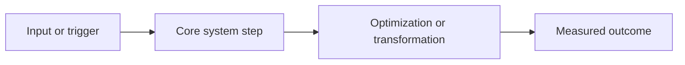

<!--
Internal planning notes. Remove before publishing.

Primary keyword:
Secondary keywords:
Main claim:
Proof points:
- benchmark
- code detail
- architecture fact
- tradeoff

Visuals to include:
1. Diagram:
2. Table:
-->

Write the opening so it earns attention fast. Start with a real result, bottleneck, decision, or surprising observation. Make the reader care in the first two paragraphs.

Set up the problem in plain English. Explain why this matters now in the context of AI, hardware, inference, compilers, local models, AMD GPUs, RDNA4, quantization, or the specific trend this post covers.

## Why this matters now

Move from context into the real issue. Keep the prose smooth and specific. Avoid filler and generic future-of-AI framing. If the topic is technical, explain the simple version first and then tighten into the deeper mechanics.

## What changed

Explain the core technical idea. This is where the post should become more concrete. Use real names, real constraints, and real tradeoffs.

If there is code worth showing, keep it short and only include the part that helps the argument.

```ts
// Replace with a real example if needed.
```

## The shape of the system

Add a diagram or schema before the article becomes too dense.



Caption: Replace with a short caption that explains what the diagram represents.

Follow the diagram with a short paragraph explaining what the reader should notice.

## What the numbers say

If the post includes benchmarks, comparisons, or tradeoffs, use a small table.

| Case | Before | After | Why it changed |
| --- | ---: | ---: | --- |
| Replace | 0 | 0 | Replace |
| Replace | 0 | 0 | Replace |

Explain the table in prose. Do not let the table stand on its own.

## The tradeoff

State what improved, what stayed hard, and what still limits the system. Strong posts do not hide the downside.

## What comes next

Close with a direct takeaway. Tell the reader what changed, what this means for the broader AI or hardware landscape, or what you are watching next.
